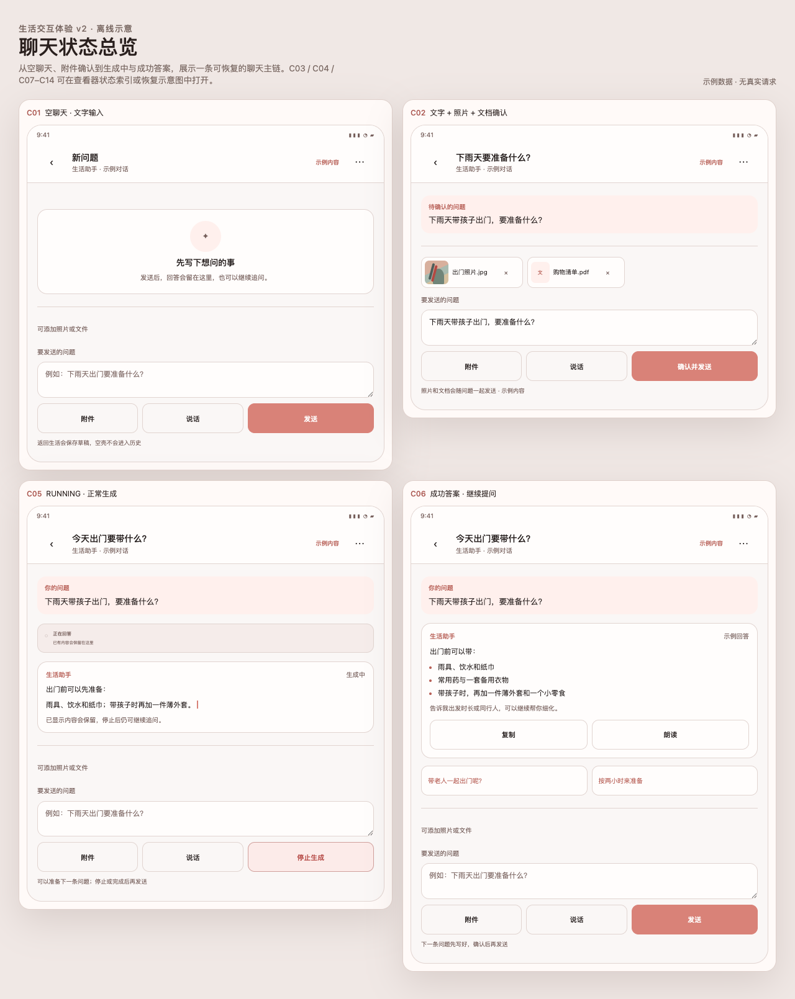
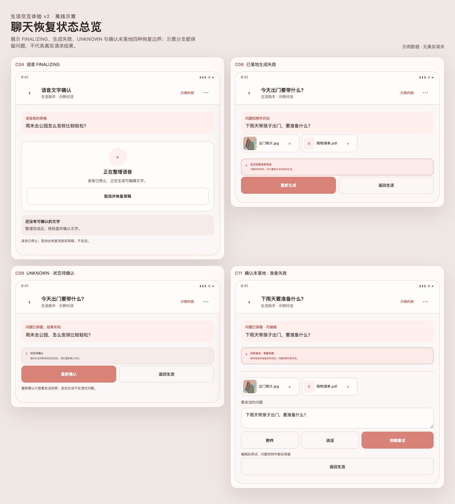
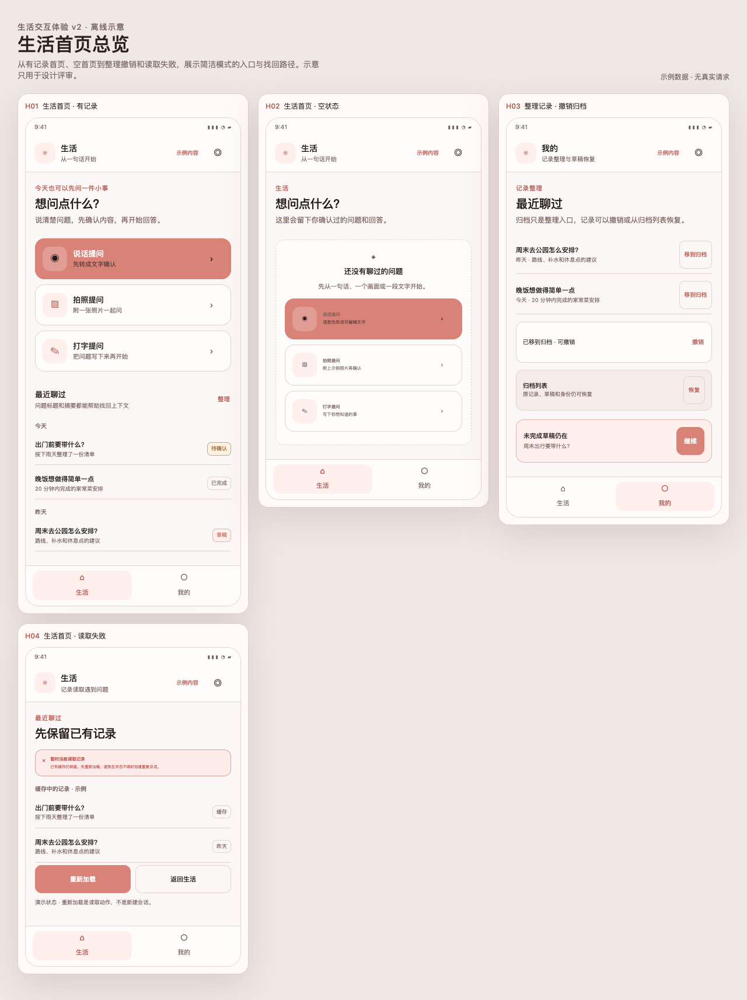

# 生活模块交互 V2 · 实现、规格与示意

2026-09-06 · 版本 2.0。生活首页、聊天、持久草稿、发送恢复和语音确认已在 Android 中实现；最终调试 APK 已完成构建与限定范围验收。实际测试范围、源码提交与 APK 摘要见 [实现与验证报告](validation.md)。

本轮最初准备交给其他 agent，随后按用户要求直接完成实现。本目录保留完整规格与示意，后续维护者可独立理解设计和验证边界。

## 查看顺序

| 内容 | 入口 |
| --- | --- |
| 实现结果、测试记录、APK 对应关系、未测项 | [实现与验证报告](validation.md) |
| 生活首页、模式、历史、草稿、归档规则 | [产品规格](spec/01-product-spec.md) |
| 聊天布局、附件、语音、发送状态与文案 | [聊天页详细规格](spec/02-chat-screen.md) |
| 当前代码入口、原始基线差距、维护任务提示词 | [代码与 Agent 交接](spec/03-agent-handoff.md) |
| A01–A50 验收定义与本轮覆盖映射 | [验收用例](spec/04-acceptance.md) |
| 可切换 18 个页面状态、宽度、字号与主题 | [离线交互示意](visuals/index.html) |
| 改造前与实现后的真实设备截图 | [现场证据](evidence/README.md) |

## 已落地的体验

- 简洁生活首页提供打字、拍照、说话三个入口；取消后无内容的记录隐藏于概览。
- 聊天首屏突出问答；高级设置进入“更多”，输入区保留附件、语音和发送。
- 文字、图片与文档用结构化草稿持久保存；准备失败或文件缺失有明确恢复入口。
- 文件消息显示文件卡片，可展开正文；首页使用可读标题、摘要与真实处理状态。
- 语音先整理、编辑和确认，再进入草稿；明确发送后才提出问题。
- 未确认的发送使用原 requestId 对账，保留跨重启恢复记录，避免重复提交。
- 归档支持即时撤销和归档列表恢复；错误读取保留缓存并可重试。
- 小屏和大字模式下输入操作可换行；暖色主题文字与按钮对比已修正。

普通模式的高级功能继续沿用。代码位于本地 `codex/life-interaction-experience` 分支，根 `test` 不会自动获得这些提交。

## 交互示意

以下为设计说明图；Android 实测截图见 evidence/implemented/，两类证据分别标注。

离线 HTML 是状态查看器。顶部字号、宽度、主题控件属于设计工具，页面内回复为示例；不调用模型，也不访问真实聊天数据。

## 后续交给 Agent

> 请先读取本目录 README、validation.md 与 spec/ 四份文档，核对当前分支是否包含 validation.md 中的实现提交。V2 已有实现，先检查现有代码与测试，不重复重建草稿或发送恢复机制。根据当前用户指定范围修复实际差距，并对照 A01–A50 中相关项补证据。示意用于理解交互，不充当 APK 验收结果。交付限定范围的提交、测试和实际未覆盖项；涉及远端推送、合并或发布时遵循当前任务授权。

patches/ 中的 b7864e1 补丁只代表最早的附件基线，不是 V2 全量代码；已有该提交或等价实现时不要重复应用。本包不含模型密钥，无需读取原对话即可使用。
