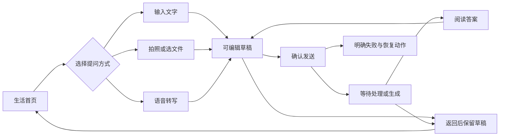

# 生活模块交互 V2 · 产品规格

版本：2.0 · 2026-09-06。审计基线：2026-09-05；本轮已完成实现，限定验收范围见 [validation.md](../validation.md)。

本文记录本轮实施所依据的产品行为；示意中的数据为样例，实际设备结果见验证报告，不代表已经发布上线。聊天页的具体布局与状态以 [02-chat-screen.md](02-chat-screen.md) 为准，实施与测试见同目录交接文件。

## 1. 目标与范围

让用户从生活页开始，在不理解模型、Wiki、上下文或队列的情况下，完成“发起问题 → 确认内容 → 发送 → 阅读答案 → 继续提问 → 找回记录”。优先服务家人使用的简洁模式，同时保留普通模式已有能力。

本轮必须覆盖生活首页、聊天页、生活历史、草稿保存、输入状态、失败恢复与字号适配。没有新后端、家庭 IM、推送、账号体系、计费、模型协议、配置加密或工作模块改造。

本轮不是更换品牌视觉。沿用 Material 3、当前珊瑚色系、主题设置与系统字体缩放，优先修正信息层级和状态反馈。

### 1.1 模式范围

| 项目 | 简洁模式 | 普通模式 |
| --- | --- | --- |
| 底部导航 | 生活、我的，沿用现有隐藏工作行为 | 保留生活、工作、我的 |
| 生活一级入口 | 说话提问、拍照提问、打字提问 | 保留智能体、知识库、全局搜索和新建入口 |
| 从生活一级入口新建 | 明确普通助手 `Assistant`，不能继承最近智能体 | 保留现有身份选择能力；新建时明确展示实际身份，不静默伪装为普通助手 |
| 打开已有会话 | 保持原会话身份，智能体会话标注“某某 · 基于资料模拟” | 保持原会话身份 |
| 聊天顶栏 | 返回、单行标题、更多 | 保留高级能力；长标题单行省略的通用修复同样应用 |
| 模型/Wiki/上下文 | 更多 → 本次提问设置/提问详情 | 可保留已有直接入口及上下文栏 |
| 草稿、附件、恢复、历史摘要 | 本文通用规则 | 同样适用，不能因模式切换丢失数据 |
| 我的 | 复用已有简洁模式、模型、语音和配置包入口 | 结构保持，避免无关重排 |

不新增“家人模式”第二套开关；复用现有 `simpleMode`。模式只影响呈现和首页新建意图，不能改变已有会话的身份、联网设置或历史数据。

简洁入口不继承最近会话的项目、智能体或 Wiki 选择。应用已保存的全局默认设置可按原规则应用，并在“本次提问设置”真实展示；系统默认挂载不算用户主动保存的会话内容。

### 1.2 与旧计划的关系

旧一期计划限定“会话列表与顶栏不动”，二期暂不做朗读大按钮和全量大字回归。V2 在本轮请求下提出明确增量：简洁模式覆盖聊天页、历史可读性、手动朗读入口与大字适配。原文件保留为历史记录，本包不回写旧勾选状态。

旧计划已经决定卓易通在首次真实交付时验证；本轮不重新设立容器预验证阻断，也不能把 HiBreak 验收写成卓易通验收。没有指定安装设备、接收人或发布渠道的外部动作，不由本 spec 推导授权。

## 2. 用户旅程

### 2.1 首页状态与布局

**H01 · 有历史**：页标题“生活”；引导“想问点什么？”；纵向三个入口；“最近聊过”列表；列表区末端或标题旁“整理记录”。不把说明文字堆成 onboarding 卡片。

**H02 · 首次使用/无历史**：三个入口保持原位置，列表区显示“还没有聊过，先问一个问题吧”。首用加载完成前显示短暂加载状态，不能先闪“暂无记录”。

**H03 · 整理记录**：每条的更多菜单有“修改标题”“移到归档”；列表的“整理记录”菜单进入归档列表。无批量永久删除。

**H04 · 读取失败**：已有缓存保留；列表区显示“暂时没能读取记录”与“重新加载”。不能以空列表掩盖异常。记录读取失败时先恢复读取，避免在会话持久层状态不明时创建重复会话。

### 2.2 一级入口

| 入口 | 操作结果 | 取消或拒绝时 |
| --- | --- | --- |
| 说话提问 | 打开普通助手会话，完成初始化后进入语音流程；权限请求只在用户点击后触发 | 留在可编辑聊天页，给“改用打字”；不自动发送、不循环弹权限框 |
| 拍照提问 | 打开普通助手会话，请求相机权限并拍照，图片先进入草稿 | 拒绝后可从相册选/打字；取消相机不制造可见空历史 |
| 打字提问 | 打开普通助手会话并聚焦输入框 | 返回时按草稿规则处理 |

入口创建期间关闭该组重复提交；第二次点击复用第一次的导航结果，不创建第二个 ID。等待真实设置和身份初始化完成，沿用现有语音冷启动修复，不能根据初始默认设置抢跑。

### 2.3 配置未完成

缺少有效供应商/模型时，允许输入和保存问题；不自动发送、不静默替换模型。聊天页 C07 提供“去设置”，进入现有模型设置页，返回同一 conversationId 和同一草稿。外部配置导入成功后也应回到有意义的生活入口；引导文案改为“配置完成，选一种方式开始提问”，不得继续指向不存在的“下方 +”。

## 3. 会话、草稿与历史

### 3.1 对象定义

- **会话**：一条持续讨论，具有稳定 conversationId、身份、消息和设置。
- **草稿**：尚未提交的一条问题；包括用户文字、图片、文档、附件处理状态和更新时间。不能用“最后一条消息”代替草稿。
- **发送尝试**：用稳定 requestId 标识一次提交意图，是否已落入本地/执行队列必须由真实查询确定。
- **执行**：已提交问题的生成过程。发送确认与生成成功是两层状态，不得共用“失败后重发”逻辑。
- **生活概览**：从上述事实派生的列表投影；不维护另一份能与执行状态冲突的业务状态。

### 3.2 空记录规则

目标是用户不看到反复取消产生的“新会话”。本轮默认在生活概览过滤真正空壳，**不要求自动物理删除数据库记录**。

只有以下全部成立才可隐藏：无任何用户/助手/工具消息、无有效草稿及未完成附件导入、无发送/执行/恢复中的任务，且用户未主动改标题、改身份或保存会话配置。任一事实未知时保留，不把加载中的对象视为空。

仅本次入口创建后原样返回的记录可归为“空壳”；旧版本中有自定义设置的空会话不能批量隐藏。首条消息、有效草稿或用户保存的设置出现后立即可见。相机/文件返回必须绑定原 conversationId；用户已经离开时，不能把迟到的结果追加到另一条会话。

新增入口来源与显式用户保留标记，避免仅靠标题内容猜测；旧数据默认保留可见。被过滤的记录不等于归档，直接按 ID 打开仍可访问。用户取消/放弃某次选择器后，使该操作 token 失效；未取消、只是正常经过系统选择器返回的结果仍属于原草稿。

### 3.3 草稿保存与恢复

1. 输入变化及时保存在应用私有存储；UI 可短暂防抖，但返回/切换会话/进入系统选择器时必须 flush 最新已接受输入。组合输入尚未提交的 IME 文本不强制当作完整文本发送。
2. 图片和文档加入草稿后，应有可跨重启恢复的应用私有副本或可靠授权引用；仅 `remember` 保存不满足本轮要求。
3. 保存文档展示名、类型、大小、抽取结果与来源引用；不得把模型凭证放进草稿。附件和大正文使用已有存储方式的合适扩展，不把大对象塞进导航参数。
4. 附件导入时显示“正在读取”；暂存成功才显示“已添加”。读失败保留原草稿，并给失败附件一个移除/重新选择出口。
5. 返回、旋转、切模式、进程重启后重开，恢复已确认加入的内容。若系统权限失效或私有文件被外部删除，显示具体缺失项并要求重新选择，不能默默忽略后发送。
6. 发送准备期间只锁定本轮内容的变更；失败后解锁并完整保留。入队确认后按本轮提交集合清除，不清掉用户后来准备的下一条草稿。
7. 用户在生成期间可准备下一条；本轮不自动发送、不自动入队。生成结束后仍需明确点击发送。
8. 草稿存储或附件暂存失败时，明确显示“尚未保存”，不能声称已经保存；提供重试、复制文字和留在当前页的选择。用户确认放弃后才可退出丢弃。

### 3.4 列表内容与排序

每条显示：标题一行、摘要最多两行、时间、一个主要状态标签，必要时补充“有草稿”。主标签优先级：待确认 > 失败 > 正在生成/等待处理 > 已停止 > 草稿 > 无标签。优先级只用于显示，所有底层事实仍保留。

摘要规则：有草稿时优先显示草稿首行；纯图片为“已选 N 张照片”；纯文档为“已选《文件名》”或“N 个文件”；无草稿时显示最近有效答案摘要，再回退到用户问题；不显示内部工具协议、附件分隔符、密钥或追踪 ID。

标题优先级：用户自定义标题 > 首个用户问题的可读正文 > 单文档文件名 > 多文档“关于 N 个文件的提问” > “照片提问” > “未发送的问题”。禁止从 `【附件：…】` 或工具协议中截标题；不额外调用模型自动命名。旧记录只做可读展示回退，不能覆盖用户自定义标题。

排序按 `lastMeaningfulActivityAt` 降序，按今天/昨天/更早分组；有效草稿修改、消息或执行终态更新可改变排序。轮询、页面进入、状态重读、无内容改变的 autosave 不更新时间，避免历史自动乱跳。

### 3.5 归档与恢复

“移到归档”是可恢复整理，不写“永久删除”。操作后显示“已移到归档 · 撤销”，默认 5 秒，使用系统可访问性建议的延长时长；不可只靠短时提示恢复。归档列表始终可恢复，恢复原 ID、消息、草稿和身份。

等待处理、生成中、发送准备中、待确认的会话不允许归档，给“问题仍在处理，结束后再整理”。不要把归档当取消任务。没有永久删除、自动清理归档或数据保留期限变更。

## 4. 交互共性

### 4.1 反馈

同一问题最多展示一个主要进度位置。状态必须来自真实流程：读取附件、准备发送、等待处理、正在生成、等待确认、已停止、失败、完成。装饰计时器不得把未知状态推断成成功、失败或已取消。

操作生效前不展示“已保存/已发送/已取消”。按钮点击期间防重复，并给出可感知的禁用或进行中反馈。可恢复错误以就地提示为主，不用重复弹窗打断聊天。

### 4.2 返回、键盘与滚动

- 系统返回先关闭弹层/键盘，再离开页面；退出前完成草稿保存。返回不取消已提交任务。
- 确认框不应在每次普通返回时出现；仅丢弃未保存内容或终止活跃语音等确有影响时出现。
- 流式输出期间，只有用户停留在列表底部才自动跟随。用户正在上翻阅读时保持位置，显示“回到最新回答”。
- 软键盘默认换行，不把中文输入法的候选词确认误当发送；实体键盘 Ctrl/Cmd+Enter 可显式发送。语音转写完成、拍照完成均不自动发送。
- 在 320dp 和 2 倍字号下允许输入工具栏换行、错误操作纵向排列；不能把发送/返回/取消推到不可触达区域。

## 5. 可访问性与视觉约束

| 项目 | 目标规则 |
| --- | --- |
| 布局 | 320、360、420dp 与宽屏；横竖切换/系统手势/键盘打开分别验收 |
| 字号 | body 建议 17sp，标题 20sp；最终采用现有主题 token；尊重系统缩放，不手写 px 锁字 |
| 字号回归 | 1.0、1.3、2.0 倍；不以缩小字体解决拥挤 |
| 触控 | 主操作与图标有效目标至少 48dp；目标不能相互覆盖 |
| 简洁模式文案 | 附件、说话、发送等高频动作有可见文字；装饰图标不重复朗读 |
| 标题 | 最多一行省略，完整标题可在更多/详情中查看；不能抬高顶栏挤占正文 |
| 对比 | 普通正文至少 4.5:1，大字至少 3:1；错误不能只靠红色表达 |
| 动效 | 尊重系统减少动态效果；水墨屏不用持续脉冲、波纹或跑马灯表示等待 |
| 读屏 | 带名称、角色和可用状态；状态以适度 live region 宣告，不能逐 token 抢焦点 |

基于 Android 官方 [Compose 默认可访问性](https://developer.android.com/develop/ui/compose/accessibility/api-defaults)、[可缩放内容](https://developer.android.com/develop/ui/compose/accessibility/scalable-content) 与 W3C [文字对比度说明](https://www.w3.org/WAI/WCAG22/Understanding/contrast-minimum.html)。具体尺寸是本 spec 的产品目标，不构成已有 APK 的合规声明。

## 6. 范围外与完成判定

不新增自动朗读默认值，不替用户开启联网，不重写模型网关，不合入 family-im 分支，不改工作模块的队列策略，不导出任何现有密钥。不用演示数据替代数据库，不把全局设置页面重做夹带进来。

完成必须同时满足：本 spec 与聊天 spec 的必需规则实现，验收案例有证据，普通模式与工作入口回归通过，构建包与实际安装包可核对。只有 HTML 示意、静态截图、可点击假按钮或单测绿色，均不等于 APK 功能完成。
