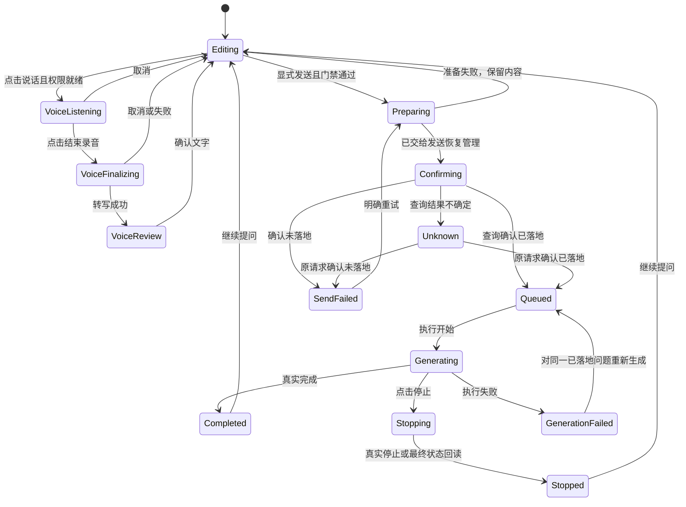

# 生活聊天页 V2 · 详细交互规格

版本 2.0 · 与 [产品规格](01-product-spec.md) 共同使用。本文状态编号用于示意和验收，不是新增数据库枚举的强制命名。

## 1. 页面骨架

简洁模式页面由四个区域构成，从上到下：

```text
┌──────────────────────────────────┐
│ 系统状态栏                       │
│ ‹  周末出门带什么？          ⋯  │  A. 返回 / 一行标题 / 更多
├──────────────────────────────────┤
│                我的问题           │
│           [照片] [文件名.pdf]      │  B. 连续消息与答案
│                                  │
│ 可以先准备这三类东西……            │
│ 1. ……                            │
│ 2. ……                            │
│ [复制] [朗读]                    │
│                                  │
│                   [回到最新回答] │
├──────────────────────────────────┤
│ 还没确认是否发出 [重新确认]        │  C. 仅必要时出现的状态/错误区
│ [照片 ×] [文件名.pdf ×]           │
│ ┌──────────────────────────────┐ │
│ │ 接着问一个问题……             │ │  D. 草稿输入和工具栏
│ └──────────────────────────────┘ │
│ [附件]      [说话]       [发送]   │
│ 系统手势区 / 软键盘避让           │
└──────────────────────────────────┘
```

A 与 D 保持可触达，B 占据剩余空间。C 不是常驻技术摘要。宽屏可限制消息最大阅读宽度并居中，不把工具栏拉散到屏幕两端。输入区随 IME 上移，不能再叠加一次重复底部安全区造成大空白。

### 1.1 顶栏

- 简洁模式仅“返回”“标题”“更多”。标题 1 行、省略，默认“新问题”；已有智能体会话以简短身份标签告知语境，不能隐藏身份而让用户误以为普通助手。
- 更多打开底部弹层，顺序：查找消息、修改标题、本次提问设置、提问详情、朗读设置。修改会话身份/模型的现有时序限制继续生效；未完成状态不能绕过门禁。
- “本次提问设置”承载模型、联网、知识库及高级参数；没有假开关。界面根据实际可用能力展示，不修改全局默认值。
- “提问详情”可查看所选消息的发送上下文；常规问题卡不显示 `requestId`、`gpt-… · 超高`、Wiki、压缩和工具执行元数据。普通模式可继续直接查看这些已有内容。
- 朗读使用现有能力；本轮不改变是否自动朗读的默认设置。

### 1.2 消息内容

**用户消息**：显示用户实际问题和附件。图片用缩略图，文件用文件名、类型、大小。文档抽取正文默认折叠，点“查看文件内容”查看；不能铺出 `【附件：…】【附件结束】` 包装协议。历史消息缺少结构化附件元数据时谨慎解析，只识别已知协议，不删掉用户手写的同名文字。渲染层变更不能改写持久化原消息正文。

**助手答案**：主区域左对齐，段落和列表正常排版。简洁模式使用“回答”或真实助手身份作简短标签，模型型号在详情中查看。代码、表格、引用与工具产物仍可访问：表格/代码仅自身横向滚动，页面本身不可横向滚动；不能为了适老化删除真实信息。

**答案操作**：完成后显示“复制”；TTS 可用且启用时显示“朗读”，播放中为“停止朗读”。未配置 TTS 时更多中给设置入口，不让灰按钮充当帮助。朗读失败显示可理解原因，可再次播放或继续阅读，不能声称已朗读。复制成功才提示“已复制”。

**追问**：默认输入占位变为“接着问一个问题”。可提供“说简单一点”“列成清单”两个本地快捷意图，但仅回填草稿，不自动请求模型；若已有非空草稿，弹出“替换当前草稿/取消”，不能覆盖用户文字或附件。不得在未批准的新模型请求中动态生成推荐问题。

## 2. 输入与附件

### 2.1 Composer 布局

- 附件条位于文字输入上方；图片有预览与“移除第 N 张照片”，文件有名称与移除按钮；移除触控目标同样 ≥48dp，不能沿用难点的 24dp 可点区域。
- 文本框最小 56dp，建议最多显示 6 行后内部滚动；长文本不挤没发送按钮。未填时“写下你想问的问题”，有历史时“接着问一个问题”。
- 底部工具栏独立一行：附件、说话、发送；每项有效目标 ≥48dp。320dp/2 倍字时允许两行布局，保持清晰标签；图标与文字的语义合并。
- 已有文字时，附件入口必须始终可用；已有图片时不必再提供第二个同名附件入口。合并重复入口前确保拍照、相册和文件能力都能到达。
- 发送可用条件：`text.isNotBlank || images.any || documents.any`，再叠加模型/身份已就绪、附件已准备好、无发送准备和无同会话待确认等真实门禁。空白文字不算 payload。
- 附件读取中禁用发送，说明“文件还在读取”；超限时保留已成功加入的内容，指出被拒绝的项和真实限制。
- 本轮沿用当前图片/文档数量、大小、格式和截断限制；实现 agent 必须从源码常量读取，不在 UI 或示意另造一套数值。

### 2.2 组合输入规则

文字、图片和文档可以任意组合；图片和文档都可单独发送。选择器取消不清空现有内容。重复选择同一附件不能静默增加重复项；有新旧内容差异时按稳定附件 ID 与内容版本判定，不能只用显示文件名。

图片/扫描 PDF 需要视觉能力时，缺少模型支持应在发送前说明并提供选择已有可用视觉模型或移除附件的路径，不自动更换供应商、上传到 OCR 或代开联网。

图片与文档正文送给模型的现有协议保持兼容；显示样式与持久化/发送协议分层。压缩上下文、模型参数和凭证流不因 UI 简化而改变。

## 3. 页面状态图



上图是 UI 解释视图；`Confirming/Unknown` 对应提交确定性，`Queued/Generating` 对应执行状态。它们可以与“有下一条草稿”并存，不能用一条全局 loading 布尔值覆盖。

## 4. 状态矩阵与文案

| ID | 条件 | 主要展示 | 可用操作 | 禁止行为 |
| --- | --- | --- | --- | --- |
| C01 | 设置已就绪但草稿为空，发送不可用 | 简短示例与输入框；不展示未配置技术栈说明 | 打字、附件、说话、更多、返回 | 空消息发送 |
| C02 | 有文字/照片/文档草稿 | 用户可编辑的问题与附件条 | 编辑、添加、移除、发送、返回保存 | 附件选择后自动发送 |
| C03 | 正在录音 | “正在听你说”；已有草稿保留 | 结束录音、取消 | 同时打开第二路录音或发送 |
| C04 | FINALIZING | “正在整理语音”；无需持续动画 | 取消整理、返回前明确结束语音流程 | 显示可点但无效的“停止录音” |
| C05 | 已落地，等待/生成 | 单一状态“等待处理/正在回答”；答案逐段出现 | RUNNING 可停止生成；QUEUED 显示不可重复点击的等待处理；均可准备下一条、返回列表 | 对 QUEUED 调用仅处理 RUNNING 的停止接口；重复状态；草稿自动入队 |
| C06 | 成功完成 | 完整答案、复制、可用时朗读、追问 | 追问回填、再次编辑/发送、查看附件 | 自动朗读、自动追问、隐藏真实引用 |
| C07 | 模型未就绪 | “还没完成模型设置，设置后就能提问” | 去设置、保留问题、返回 | 无说明灰按钮、默认切供应商 |
| C08 | 已落地生成失败 | “这次没能回答，问题已经保留” | 对原问题重新生成、查看详情、准备新问题 | 新增一条重复用户消息 |
| C09 | 提交 UNKNOWN | “还在确认是否发出，先别重复发送” | 重新确认、返回生活；问题只读可查看 | 直接重发、清空问题、宣称取消了服务器任务 |
| C10 | 更多/设置 | 当前会话的真实设置与解释 | 按现有权限和门禁修改、返回草稿 | 把模型设置转成无效演示开关 |
| C11 | 确认未落地/准备失败 | “没有发出，问题已保留”或具体准备失败原因 | 编辑、明确重试、返回 | 把确定失败与 UNKNOWN 共用重试 |
| C12 | 转写成功待确认 | 可编辑的识别文字；“确认后再发送” | 编辑、确认使用、重新说、取消 | 识别完成后自动发送 |
| C13 | 已停止 | “已停止”，保留已经生成的正文 | 复制、继续提问；如有原能力可重新生成 | 把主动停止标为失败、补发下一条草稿 |
| C14 | 附件导入中/失败 | 文件名及“正在读取/读取失败” | 取消该项、重选；其它草稿保持 | 超时即假装成功、丢掉其它附件 |

### 4.1 语音细则

录音只能由用户点击发起。已有草稿作为基线，转写结果先在确认区查看；确认使用时追加到旧文字末尾，非空旧文字与新转写之间插入一个换行，不能覆盖旧文字。取消恢复进入语音前的文本、图片和文档。连续两次语音以前一次已确认的完整草稿为新基线，不重复追加同一 session 的结果。

`FINALIZING` 的取消必须传入识别 session/generation ID 并使该次迟到回调失效；即使底层云请求不能中止，也不能在用户取消后把结果回填到当前或其它会话。明确离开聊天页视为离开本次语音流程，需要中止采集并避免后台继续收音。仅切到后台时，录音/整理阶段取消；已进入 REVIEW 的文字确认结果保留，返回前台可继续编辑确认。错误可切换到打字，不循环触发权限。

朗读与录音不能同时抢占音频：开始录音前停止本应用朗读；不得修改其它应用的播放设置。文字流式生成中不自动分段朗读。保留已有“完成后自动朗读”设置，但仅在该偏好已启用且没有语音输入流程时执行；不改变用户全局偏好。用户也可主动朗读已完成答案。

### 4.2 发送准备与恢复

准备步骤（身份/附件/知识库快照）开始时捕获本轮内容，锁定本轮修改；失败解锁并保留文字、图片和文档。不能在准备成功前清空 pendingDocuments。

提交给 recovery 后沿用稳定 requestId。查询确认未落地才允许用户显式重试；本轮优先复用原意图去重 ID，并让请求管理器决定重试生命周期，UI 不自己生成第二个并发提交。若现有管理器需要新 requestId，必须先消费终态、保证原尝试不会迟到入队，并补幂等测试。

UNKNOWN 的“重新确认”只查询/对账同一个 requestId；查询中按钮防重复。返回生活不停止后台对账，历史持续显示待确认。进程重启后仍应恢复该关联，未查清前不能以“没有内存 state”放开发送。

本轮将现有每 250ms 的无限轮询改为有界恢复：首次进入 UNKNOWN 后可按 1、2、4、8、15 秒间隔最多自动重查 5 次；仍查询失败则保留待确认并等待手动操作。回到前台或重启只触发一次合并后的重查，不重新开启无限循环。手动确认一次只执行一次查询，和自动查询按 requestId 合并。计时只决定何时查询，绝不把“超过某秒”当作未落地或取消。

“确认未落地”要求原提交工作已经结束，且权威持久队列查询成功返回不存在。若原提交仍可能完成，或队列不可读取，继续 UNKNOWN。终态消费、草稿恢复与解除发送门禁必须按同一原请求进行，不能因重查按钮或页面销毁提前解除。

本进程以 manager 持有的原 requestId 对应 enqueue Job 实际完成为结束信号；进程启动恢复记录只做队列查询，不能再次 enqueue，也不能在同一进程重建 manager 时把仍运行的任务当成已结束。附件准备状态同时守卫输入栏 canSend 和实际 sendNow/快捷键入口。

若已收到部分答案再失败，正文保留并标记未完成；重新生成必须走已落地问题的执行重试能力，保留原问题，不通过普通 `sendNow()` 再插入用户消息。

现有 `retryFailed(entryId)` 仅允许该会话最新的 FAILED execution 重排同一条执行记录；使用这一边界。用户明确点击重新生成后，可替换原来未完成的助手答案，原用户问题不变。非最新失败消息不展示一个注定拒绝的重试按钮，保留查看与复制。并发/重复点击被拒时回读真实状态并给反馈。

### 4.3 生成中准备下一条

生成中用户可编辑下一条草稿和添加附件。主操作仍是“停止生成”，不得让新草稿的出现把停止改成立即发送。生成完成/停止后显示“发送”，只有用户再点击才提交下一条。

仅 RUNNING 使用“停止生成”。已知 QUEUED 时主操作显示不可重复点击的“等待处理”，仍可准备草稿和返回生活；不能调用只处理 RUNNING 的 `cancelActive()` 后声称取消了排队。普通模式现有排队编辑/删除/引导入口继续按真实状态保留，本轮不增加简洁模式的队列管理界面。

必须保留队列编辑原有语义。普通模式已有的排队、编辑、暂停入口不能被重命名的共享草稿 helper 意外改变。来自系统文件选择器/扫描 PDF 的迟到附件更新，也走统一 current draft 更新路径。

## 5. 关键尺寸与折行规则

| 元素 | 常规值/上限 | 320dp / 大字策略 |
| --- | --- | --- |
| 页面横向留白 | 16dp，沿用主题 spacing | 不低于 12dp；不靠压缩点击目标解决空间 |
| 顶栏 | 使用 Material 3 容器与 inset | 标题始终单行；更多保留完整目标 |
| 输入框 | 最小 56dp，可增长到约 6 行 | 超限内部滚动；工具栏不进入输入框内部 |
| 高频按钮 | ≥48dp，标签可见 | 工具栏换行，发送保持末项；禁止挤出视口 |
| 文件 chip | 文件名单行省略，删除目标 ≥48dp | chip 可换行或附件区域独立滚动；全页无横向溢出 |
| 错误动作 | 常规可并排 | 大字时纵排；长错误正文可展开，不遮住输入 |
| 答案 | 建议 body 17sp，段落间距由主题决定 | 支持 2 倍字，表格/代码局部滚动 |
| 底部避让 | IME + navigationBars 按窗口策略统一计算 | 实际键盘开合验证，不以静态 preview 代替 |

## 6. 不可退化的底线

1. 不重新引入“有文字后附件入口消失”或“文档单独发送被禁用”。
2. 不把 UI 隐藏误作权限收缩：原模型、智能体、Wiki、搜索、消息查找和工作能力仍可从合法入口访问。
3. 不将发送准备、是否入队、生成中和语音整理混为一个 `isBusy`；可保留共享组件，但决定按钮状态必须使用明确事实。
4. 不在 UNKNOWN 上放“重新发送”快捷键，不让停止只改本地 UI 而没有执行结果回读。
5. 不用示意中的固定答案、假的“复制成功/正在朗读”或假延时完成实现验收。

对应实现位置、切片和测试编号见 [03-agent-handoff.md](03-agent-handoff.md) 与 [04-acceptance.md](04-acceptance.md)。
