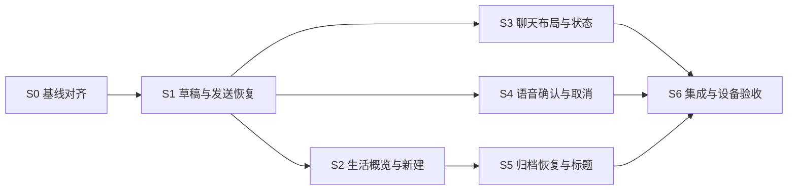

# 生活交互 V2 · 实施 Agent 交接

## 1. 任务结果与当前状态

生活首页和聊天页 V2 已直接实现，当前状态为本轮代码完成、限定验收通过。源码提交与实际覆盖范围以 [validation.md](../validation.md) 为准。下方 b7864e1 能力表和 S0–S6 切片保留为改造前审计与设计依据，不代表当前仍然缺失。

产品规则优先于示意中的文案长度/样例值；[01-product-spec.md](01-product-spec.md) 与 [02-chat-screen.md](02-chat-screen.md) 为行为来源，[04-acceptance.md](04-acceptance.md) 为完成门槛。出现真实冲突先列出规则编号，不根据截图猜业务。

### 基线

- 仓库：`harness-apk`，Kotlin + Jetpack Compose + Room。
- 已核对根 `test`：`aef65adc6722710004ebd5f9dcb5074f5cc6a61f`。
- 本地修复基线：`b7864e19d525d49ae1dff7157f6385597b2adf5d`，分支 `codex/life-interaction-experience`。
- 基线提交已修复：文字后附件入口保留、文档单独发送、准备失败文档保留、扫描 PDF 更新 current draft、队列编辑 helper 语义。
- 根 test/main **没有自动取得该本地提交**。先检查 `git merge-base --is-ancestor b7864e1 HEAD`；不包含时比较基线补丁，仅移入这一笔修复或验证已有等价实现，不重复改造同一逻辑。
- 原机已安装的本地验证 APK 摘要为 `ae84ed1c9e3c7a1d846245470d77b6dbfa5574986782e48e3dd7bd656f6cfc96`；这不是 V2 完成包。
- 本轮文档作者未授权你推送、合并、发布、联系其他人或操作未指定的设备。按接收任务时用户给出的授权范围执行。

本包 `patches/` 提供基线修复，`evidence/` 提供少量无密钥现场截图。可使用当前目录所在仓库，也可将整个包解压到另一 checkout 后按上述 SHA 对照。

## 2. 改造前能力与增量依据（b7864e1 快照）

下表仅描述 b7864e1 时点。路径相对于仓库根，旧行号仅作定位线索；当前事实以现有符号和验证报告为准。

| 范围 | 已有事实 | V2 增量/入口 |
| --- | --- | --- |
| 首页 | `ui/conversation/ConversationListScreen.kt`，`ConversationListUiState.kt` 仅过滤 projectId 并展示标题/更新时间 | 新增聚合概览、空/加载/失败、草稿/执行状态、归档恢复；不能假定有 `Conversation.summary` |
| 新建身份 | `ui/NewConversationRequest.kt`，`chat/NewConversationUseCase.kt:32-70`，`agent/ConversationIdentityRepository.kt` | 简洁入口使用 `InitialConversationIdentity.Assistant`；新建防连点和操作 token |
| 会话元信息 | `storage/ConversationEntity.kt:7-21`，`ConversationDao.kt:12-76` | 没有概览摘要、空壳来源/用户保留标记、归档列表恢复 API；按最小数据需求新增 |
| 最近问答 | `storage/MessageDao.kt:18-41`，`chat/ChatRepository.kt:287-299,347-352` | 可复用真实消息，新增批量聚合/Flow；不要每行单独查询造成 N+1 |
| 压缩记忆 | `ConversationMemoryEntity.kt:18-24` | summary 是上下文压缩结果，不直接当用户历史摘要 |
| 草稿 | `chat/ConversationDraftStore.kt:14-66`，`ui/chat/ChatScreen.kt:621-641` | 目前 SharedPreferences JSON 仅 text/images，save 使用 apply；需支持可等待完成的持久保存、文档/元数据/版本/更新时间 |
| 发送确定性 | `chat/ChatSendRecoveryStore.kt:51-177` | 现有进程内 state；需与持久发送意图记录组合，不直接以进程重启清空门禁 |
| 提交恢复 | `chat/ChatSendRecoveryManager.kt:50-176` | 当前 UNKNOWN 每 250ms 自动重查；没有公共人工 recheck/cancelUnknown；新增原 ID 的合并重查与有界退避 |
| 幂等队列 | `chat/ChatExecutionRepository.kt:48-90` | 已有 requestId 去重，必须复用；不得加第二套并发发送接口 |
| 停止 | `chat/ChatExecutionCoordinator.kt`、`ChatExecutionRepository.kt:283-293` | 现有取消是针对已知执行；不能作为 UNKNOWN 提交取消的证明 |
| 生成失败重试 | `ChatExecutionCoordinator.retryFailed(entryId):149-156`，`ChatExecutionRepository.retryFailed:303-320` | 仅最新 FAILED 执行可原子改回 QUEUED，保留 userMessageId；禁止绕过此入口再插 USER。必要时给 UI 暴露 REQUEUED/REJECTED 结果 |
| 语音 | `voice/VoiceInputState.kt:41-99`、`ui/voice/SystemVoiceInputHost.kt:349-410` | reducer 有 CancelRequested，host 有 cancel，但聊天 UI 未独立接线；补 FINALIZING 取消、session token 与确认使用 |
| 附件 | `chat/DocumentTextExtractor.kt:41-93`、`QueuedAttachmentStore.kt:61-199`、`ChatImageStore.kt` | 文档被拼入文本；图片队列副本已有，图片草稿仅 URI；补 typed draft 附件与私有持久副本 |
| 聊天呈现 | `ui/HarnessApkApp.kt`、`ui/chat/ChatScreen.kt`、`ConversationContextBar.kt` | simpleMode 下收起顶栏/上下文，通用标题和 composer 改版；复用旧发送控制，不另造引擎 |
| 数据库 | `storage/AppDatabase.kt` 当前 version 26 | 如增加 Room 字段/表，显式 migration 与旧库测试；不破坏性重建 |

### 当前硬限制（沿用，不扩容）

- 文档：每条最多 3 个、单文件 10 MB、每个抽取正文最多 20,000 字符，见 `DocumentTextExtractor`。当前实现先 readBytes 再判大小；V2 私有复制时应使用计数流提前终止超限，避免为了 UI 稳定性读取任意大文件。
- 图片：每条最多 4 张，源文件 8 MB；发送层还有压缩后 8 MB payload 检查，见 `ChatScreen` 与 `SendMessageUseCase:457-506`。不是简单放宽任一上限即可绕过。
- 扫描 PDF：延续现有转图片流程，和普通图片共用 4 张额度；提示实际选取页数和任何截断，不偷偷接入 OCR。
- 文本抽取截断时说明只发送已提取的部分，不能暗示整份文件都已分析。

## 3. 设计契约及实现约束

下列契约描述设计约束；现有实现已采用相应内部模型，无新增远端 API。维护时优先复用下方实际代码入口，不建立平行状态机。

### 3.1 `LifeConversationOverview`

建议包含：conversationId、displayTitle、titleOrigin、previewText、lastMeaningfulActivityAt、draftPresent、主要展示状态、独立的发送确定性/执行状态、身份摘要、isArchived、是否来自 V2 入口/用户显式保留。对外提供批量可观察结果，loading/error 与空列表分开。

titleOrigin 应区分显式改名与派生标题；旧数据没有来源时保守保留原有可读标题，对明显系统生成的附件协议标题只做展示回退。新入口来源和用户保留标记只用于生活概览，不影响工作会话、归档或按 ID 访问。

### 3.2 持久草稿与附件

沿用/扩展 `ConversationDraftStore`，最少记录 schemaVersion、conversationId、text、updatedAt、附件清单。附件建议有稳定 ID、kind、MIME、displayName、size、sha256、私有路径或引用、抽取正文引用、准备状态及失败原因。

- 私有复制完成、校验/抽取结果可恢复后才算 READY；失败项不是不存在，留出重选路径。
- 发送前冻结一份提交快照；按附件 ID 和内容版本清理本轮提交集合，不能把发送期间新来的同名/同 URI 文件一起移除。
- 图片/文档不能因 `content://` 授权失效在重启后静默丢失。
- 删除草稿附件只删除本应用拥有且不再被消息、队列、恢复记录引用的文件；绝不删除外部用户源文件。
- 兼容旧 text/images JSON；读到未知版本/损坏文件时保留能恢复的内容并给错误，不以空对象覆盖旧数据。
- 待发文档为 typed list；不可把嵌入协议块当完整附件模型。历史消息缺元数据时使用安全显示回退，不要求整库重写正文。

### 3.3 持久发送意图与重查

可用应用私有原子文件、扩展现有存储或小型 Room 表；选择最轻的可验证实现。记录必须至少关联 conversationId、requestId、原 payload/附件快照、providerId/model/非密钥上下文引用、尝试阶段。不得序列化 provider 的明文 key。

关键顺序：持久化发送意图成功 → 执行既有幂等入队 → 原 requestId 查询/归类 → 终态草稿合并与清理记录。若意图落盘失败，停在可编辑草稿，不启动发送。

启动时恢复未决意图，先对原 ID 查持久执行记录，再决定是否允许发送。查询失败仍 UNKNOWN；存在则绑定已落地执行，不新增用户消息；原任务确已结束且查询成功不存在才判未落地。

新增手动重查要与自动恢复共享每请求单飞控制；遵循聊天 spec 的 1/2/4/8/15 秒最多 5 次退避。没有 `cancelUnknown()` 现成 API，本轮也不提供“取消服务器请求”的假能力。

### 3.4 界面派生状态

区分：设置/身份是否 ready；语音阶段；附件准备状态；提交确定性；已知执行状态；下一条草稿。UI 状态由控制器聚合，不在多个 Composable 各自推导 conflicting booleans。可以抽取小而清晰的 reducer/mapper，不进行整个 ChatScreen 的架构迁移。

## 4. 原实施切片与依赖（维护参考）



S2/S3 只能在 S1 的具体契约已发布后并行；同一 `ChatScreen.kt`、`HarnessApkApp.kt`、`AppContainer.kt` 文件同时只允许一名写入负责人。没有必要为每个切片创建一个独立长期 agent；单个 agent 按序做也符合本 spec。

| 切片 | 内容与建议所有权 | 完成后才能解锁的消费者 |
| --- | --- | --- |
| S0 | 核对当前分支和 b7864e1；接入或验证等价修复 | 输出基线 SHA 与原附件测试通过记录，解锁 S1 |
| S1 | 草稿/附件持久化、发送意图恢复、人工确认与退避；所有权 chat/storage 小范围契约 | 输出干净提交、模型/方法签名、旧数据 fixture、UNKNOWN 三分支与重启测试，才解锁 S2/S3/S4 |
| S2 | `ui/conversation` 的概览、三入口、空/失败态与新建身份；新建/路由共享修改由集成负责人处理 | 输出聚合 Flow/DTO 和 H01/H02 可运行页面，解锁 S5/集成 |
| S3 | 聊天顶栏/消息渲染/composer/更多/恢复提示；独占 `ChatScreen.kt` 与相关组件 | 输出 C01/C02/C05-C11/C13/C14，包含普通模式能力回归 |
| S4 | `voice` 与 `ui/voice` 的 session、确认、取消；ChatScreen接线请求由 S3 负责人落地 | 输出明确 voice session 契约与迟到回调 fixture；S3 接线并跑 C03/C04/C12 |
| S5 | 归档列表/恢复、标题/摘要兼容、无空壳列表；数据库迁移由 S1/集成负责人统一 | 输出已归档数据 fixture 和重启恢复证据 |
| S6 | 合并依赖、普通模式/工作回归、APK与设备矩阵、清理调试设置 | 输出最终 SHA/APK hash、完整验收表和真实限制 |

每个生产者交接时必须给：修改范围、提交 SHA、契约或 fixture、失败恢复语义、验证命令与结果、消费者“现在可开始”的证据。仅“代码差不多写完”不解锁下游；未就绪时可用同契约 fixture 做布局，但不得作为功能验收。

## 5. 验证方法

先写会失败的关键状态/持久化用例，再做最小实现；不要求为每条文案新增单测。

建议沿用的测试入口：

```bash
./gradlew :app:testDebugUnitTest \
  --tests com.harnessapk.ui.chat.ChatUiStateTest \
  --tests com.harnessapk.ui.chat.ChatConversationControllerTest \
  --tests com.harnessapk.chat.ChatSendRecoveryStoreTest \
  --tests com.harnessapk.chat.NewConversationUseCaseTest \
  --tests com.harnessapk.ui.conversation.ConversationListUiStateTest

./gradlew :app:compileDebugAndroidTestKotlin
./gradlew :app:assembleDebug
git diff --check
```

新增草稿/迁移/重查/语音 session 的测试类加入实际执行清单。仪器测试应覆盖真实组件组合，不能把按钮分别放到测试根节点后宣称完整输入栏无重叠。

测试失败注入须在 fake 仓储、可控 dispatcher 或临时测试实现进行：快照异常、提交已落地但返回异常、权威查询异常、读取返回不存在、迟到语音结果、草稿存储失败、附件复制中断。避免为复现而破坏真实用户数据库或断开所有系统网络。

在明确授权的设备安装时：先 `adb -s <serial> devices` 确认 device，再 `svc power stayon usb` 并核对 bitmask 包含 2。保存原分辨率、字号、输入法设置；同签名覆盖安装，结束恢复。不能复用报告中的序列号推定当前设备授权，也不能直接清空现有应用数据。

320/360/420dp、字号 1/1.3/2、IME 开关、长标题/长文档/语音/UNKNOWN/失败，按验收表出证据。记录源提交、版本、APK SHA、设备已安装 hash 和测试账户/模型的非敏感标识；源码/构建/安装/真机结果分开。

旧资料引用的 `superpowers:*` 工作流不是本包依赖；遵循接收环境中实际安装的技能与项目 AGENTS，不扫描仓库或 sibling repo 的 Skill 源码。

## 6. 不能算完成的情况

- 只实现静态 UI，按钮指向假延时或固定答案。
- UNKNOWN 重启后消失，或重查产生第二个 requestId/用户消息。
- 文档用 `remember` 保存、照片仍依赖临时 picker URI，却声称支持跨重启。
- “停止/取消”只改本地文案，迟到回调仍污染草稿。
- 改简洁模式时隐藏已有智能体身份、丢普通模式入口或影响工作队列。
- 仅桌面 HTML 320px 截图，无 Android IME/字体/触控/读屏证据。
- 未说明未测设备/容器、未发布状态，或把 CI 上传成功算作业务通过。

## 7. 当前实现入口与维护提示

| 责任 | 实际文件/符号 |
| --- | --- |
| 首页批量聚合、派生标题/摘要/状态、归档与重订阅 | `chat/LifeConversationOverview.kt`、`storage/ConversationDao.kt`、`storage/LifeConversationMetadataStore.kt` |
| 草稿结构、私有附件副本、旧 JSON 兼容 | `chat/ConversationDraftStore.kt`、`ui/chat/LifeDraftPresentation.kt` |
| 持久发送 journal、原 ID 查询、单飞、有界退避 | `chat/ChatSendIntent.kt`、`ChatSendRecoveryStore.kt`、`ChatSendRecoveryManager.kt` |
| 文档消息表现与原始问题字段 | `chat/ChatDocumentPresentation.kt`、`ChatExecutionModels.kt` |
| 首页/聊天布局、新建身份与返回保存 | `ui/conversation/ConversationListScreen.kt`、`ui/chat/ChatScreen.kt`、`LifeChatComponents.kt`、`ui/HarnessApkApp.kt` |
| 语音阶段、结果确认、取消迟到回调 | `voice/VoiceInputState.kt`、`ui/voice/SystemVoiceInputHost.kt` |
| 组合输入栏、存储恢复、归档故障回归 | `app/src/test` 与 `app/src/androidTest` 下的同名测试；具体命令见 validation.md |

当前没有 Room 表结构变化，数据库仍为 version 26；新增来源/撤销期限元数据使用独立本地存储。旧消息正文不重写，旧协议标题只在具备自动生成证据时做只读显示回退。发送快照不序列化模型密钥。

> 请先核对 validation.md 中的实现提交，阅读现有代码与测试，再针对当前用户指明的差距修改。保留原 requestId 幂等入队、typed 草稿、原子 journal 和普通模式能力。A01–A50 是完整验收定义，本轮覆盖映射不等于全矩阵设备认证。变更后提交适当回归与实际设备证据，不把设计示例、源码可编译或其他分支的结果算成当前运行结果。
