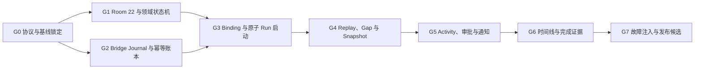

# M2 手机与 Mac 连续 Run Implementation Plan

> **For agentic workers:** REQUIRED SUB-SKILL: Use superpowers:subagent-driven-development (recommended) or superpowers:executing-plans to implement this plan task-by-task. Steps use checkbox (`- [ ]`) syntax for tracking.

**Goal:** 让一个项目任务从 Android 发起后，由 Mac Bridge + Codex app-server 执行，并在断网、Android 进程重建和 Relay/WebSocket 重连后仍可恢复、转向、审批和验收。

**Architecture:** 保留 Wire V1 的短期加密传输，在其上增加“持久化命令 Outbox + Bridge 幂等命令账本 + Logical Event Journal + 权威 Snapshot”四层恢复语义。Android 用 Room 保存 Binding、Run、Event、Approval、Outbox 和 Host-Device 级同步游标；Bridge 负责工作区身份、app-server 协议适配和结构化完成证据；Activity 只是本地聊天与远程 Run 的合并读模型，不合并执行器。

**Tech Stack:** Kotlin、Jetpack Compose、Room 21 -> 22、Coroutines/Flow、OkHttp WebSocket、Go 1.23、Codex app-server JSON-RPC、AES-256-GCM、Aliyun Push。

---

日期：2026-08-08

最近更新：2026-08-09

实施周期：2026-09-08 至 2026-10-07

实施分支：`codex/m2-cross-device-run`

人工合并目标：`test`（本分支不自动合并、不推送）

当前状态：`IN_PROGRESS`；G0/G1 已完成，G2 Bridge state v2、Journal 与命令幂等实施中；三个产品边界继续采用第 2 节默认建议

## 1. Source Of Truth 与范围纪律

按优先级使用：

1. `docs/product-plan.md` v5 的 M2 段落和三个月范围熔断。
2. `docs/superpowers/specs/2026-08-07-m2-cross-device-run-design.md`。
3. 本文件：把 Spec 中未落到代码契约的部分收敛为可执行 Gate、数据结构、协议和证据格式。
4. `docs/superpowers/plans/2026-08-07-m1-zero-friction-capture-progress.md`：确认 M1 依赖和禁改边界。
5. 当前 `test` 的 Android、Relay、Bridge 和 Codex app-server 实现。

冲突处理：产品目标和不可协商原则优先；本文件对实现细节的收敛优先于 Spec 中仅有概念、没有可重试数据或协议字段的示例。若要改变“项目是唯一长期归属”“不自动写文件/Commit/Push”“不新增任务 Tab”，必须先更新产品计划和 Spec，不能在实现中静默扩大。

实施只在 `/Users/tony/Documents/harness-apk/.worktrees/m2-cross-device-run` 和 `codex/m2-cross-device-run` 进行；不修改主工作树中的 M1 阿里云实时语音文件，不自动合并回 `test`。

并行隔离是硬约束：M2 实施必须同时使用独立 Git worktree/分支、独立 AVD、独占 emulator console/adb 端口和独立 ADB server port。禁止复用 M1 的模拟器数据目录、`emulator-5554`、默认 5037 ADB 会话或任何未显式声明 owner 的真机。

## 2. 实施就绪度结论

### 2.1 结论

现有 M2 Spec **不能直接按文中数据类开始端到端编码**，但已足够进入 G0 协议锁定和 G1 Room 基础。经过本计划补齐原子 `run.start`、Outbox 可重建载荷、设备级 Sequence、ACK 时机、app-server 决策映射、Bridge 完成证据和迁移纪律后，主链路达到“Ready, with known acceptance checks”。

以下三个问题会改变产品边界。为避免阻塞首批工作，若用户没有覆写，实施按每项“建议”作为默认；对应 Gate 前仍要在台账记录最终选择：

1. **Mac 连续使用的含义。** 当前 Bridge 启动并独占一个 headless `codex app-server --listen stdio://`，Mac 上的 ChatGPT/Codex UI 不是同一 JSON-RPC 客户端，不能直接处理这个进程的未决审批。建议 M2 首版定义为“Mac 是执行主机，手机是监督与审批面；Mac UI 不属于该 Run 的控制面，不承诺发现、查看或接管同一活跃 Turn，用户仍可在 Mac 查看工作区文件”。若必须在 Mac UI 与手机间双向接管同一活跃 Turn，先增加 managed app-server daemon/proxy 的兼容性探索，G3 不得按当前四周范围继续。
2. **`item/tool/requestUserInput` 是否在手机作答。** 当前 app-server 将它定义为独立的 `answers` 响应，不是审批决定；现 Bridge 把它误归类为 Approval。由于 Bridge 独占 headless app-server，当前 Mac UI 也不能处理同一未决请求。建议 M2 首版正确显示为 `WAITING_USER`，明确说明“当前任务不能在跨端链路继续”，主动作是保留证据并在 Mac UI 重新发起，不伪造成审批或声称可接管同一 Run。若要求所有这类任务也能只用手机闭环，需要在 G1 结束前增加 `remote_user_input_requests` 表，并在 G5 增加问题 UI、`user_input.respond` 协议和恢复测试。
3. **M2 是否显示“沉淀到项目”。** M2 Spec 要求完成卡生成入口事件，但产品计划把“Run -> 项目 Markdown -> Git”闭环放在 M3；当前没有可完成的落点。建议 M2 不显示假入口，M3 闭环可用时再显示。若必须保留入口，需在 G6 前明确事件接收方、失败反馈和 M3 未安装时的用户去向。

### 2.2 已经足够的部分

- 用户对象、主链路、弱绑定、活动三分组、时间线信息预算和失败恢复目标清楚。
- M1 Context Snapshot V2、全局深链和 Room 20 -> 21 已交付，可作为 M2 的基础。
- Wire V1 的 AES-GCM、Message ID、Transport Sequence、ACK、Relay 离线队列和 Aliyun wake Push 可继续复用。
- app-server 的 `thread/list`、`thread/read`、`thread/start`、`turn/start`、`turn/steer`、`turn/interrupt` 可用。
- M2 的范围熔断明确：Binding、Run 持久化、审批可达优先于时间线美化和丰富完成卡。

### 2.3 仍不顺的部分及本计划修正

| 领域 | 当前事实/Spec 缺口 | 本计划固定解法 | Gate |
| --- | --- | --- | --- |
| Outbox | `RemoteCommandRecord` 只有 payload 哈希，进程重建后无法重发原命令 | 保存 canonical `payloadJson`、哈希、重试时间、结果和错误；网络重试复用 `commandId` | G1 |
| Run 启动 | 现有 `thread.start -> turn.start` 是两个临时请求，中间崩溃会产生半个任务 | 新增 Bridge 业务命令 `run.start`，内部原子编排并由命令账本去重 | G2/G3 |
| Sequence | Spec 同时描述“每设备 Journal”和 Run 上的 `lastLogicalSequence`，作用域不清 | Logical Sequence 只在 `(hostId, deviceId)` 流内单调；Run 字段只是最近已应用事件，不是恢复游标 | G1/G2 |
| ACK | 当前 Android 解密后立即发 Wire ACK，Room 还未落库 | Transport ACK 与 Logical ACK 分离；事件 + 衍生状态 + Cursor 同事务提交后才发 `event.ack` | G2/G4 |
| Bridge 路由 | `threadOwners` 只在内存，Bridge 重启后丢失 | 持久化 `bindingId/workspaceId/threadId/turnId/runId/deviceId` 路由；app-server 进程 epoch 变化时审批转 STALE | G2 |
| Wire TTL | 过期 `PendingOutbound` 直接删除 | Journal 保存逻辑事件；重放时生成新的 Wire ID/Nonce/Transport Sequence/TTL | G2/G4 |
| 审批协议 | UI 发送 `allow/allowAlways/deny`；当前 app-server 接受 `accept/acceptForSession/decline/cancel` | M2 只映射 `accept` 与 `decline`；不发送 `acceptForSession`，停止单独走 `turn/interrupt` | G0/G5 |
| 用户提问 | `requestUserInput` 被误当审批；headless Bridge 也没有 Mac UI 可接管 | 默认转 `WAITING_USER` 并明确同一 Run 不可继续；若扩成手机作答，先增加独立表/协议，不能复用 Approval 假响应 | G1/G5 |
| 完成卡 | 当前 app-server 没有独立 Git Item，Agent 自述也不是证据 | Bridge 在 Run 前后采集结构化 Git/工作区基线；测试只认已知测试命令 + exit code | G3/G6 |
| 项目生命周期 | Project 是文件目录，不是 Room 外键；Binding 不能建真实 FK | Binding 的 `projectId` 不设 FK；删项目时解绑，历史 Run 靠 `projectNameSnapshot/bindingSnapshotJson` 可读 | G1/G3 |
| M1 状态 | M1 Gate 已 DONE，但荣耀真机 A2 和实时语音工作仍在进行 | M2 不碰语音文件；最终发布 Gate 必须记录 M1 真机状态，不能把 WIP 基线写成全绿 | G0/G7 |

### 2.4 建议停止补充的部分

- 不再扩展顶层任务模式、第四个 Tab、手机终端或文件同步。
- 不为旧 Remote Screen 继续增加新建线程能力；它只保留历史诊断和旧 Bridge 兼容。
- 在第 2.1 节边界确认前，不实现“沉淀到项目”的假按钮；M3 能提供可用闭环时再显示。
- 不尝试把所有 app-server Item 都产品化。未知 Item 保存脱敏诊断并显示“正在处理”。

## 3. 2026-08-08 当前基线证据

### 3.1 仓库与并行改动

- 审核开始时 `/Users/tony/Documents/harness-apk` 位于 `test@f596fe9`，与当时本地 `origin/test` 引用无 ahead/behind，初始工作区干净。
- 审核运行期间，另一条 M1 工作流修改了阿里云实时语音文件，随后以 `2510016 功能：接入阿里云实时语音转写` 提交。当前 `test` 已前进到该提交、相对本地 `origin/test` ahead 1，工作区除本 M2 文档外干净。M2 后续每个提交仍必须显式 `git add` 本 Gate 文件，禁止 `git add .`。
- 该 M1 提交涉及、M2 不应回改的范围至少包含：
  - `app/src/main/java/com/harnessapk/voice/AliyunRealtimeProtocol.kt`
  - `app/src/main/java/com/harnessapk/voice/AliyunRealtimeTranscriptionClient.kt`
  - `app/src/main/java/com/harnessapk/voice/PcmVoiceRecorder.kt`
  - `app/src/main/java/com/harnessapk/voice/VoiceCredentialStore.kt`
  - `app/src/main/java/com/harnessapk/voice/VoiceModels.kt`
  - `app/src/main/java/com/harnessapk/storage/AppSettingsStore.kt`
  - `app/src/main/java/com/harnessapk/ui/voice/SystemVoiceInputHost.kt`
  - `app/src/main/java/com/harnessapk/ui/voice/VoiceSettingsScreen.kt`
  - 对应 `app/src/test` 与 `app/src/androidTest` 语音测试，以及 `AppSettingsStoreTest.kt`。

### 3.2 Android/Room

- `AppDatabase` 当前 version 是 21，`MIGRATION_20_21` 已增加本地搜索表和回填。
- `AppContainer` 明确串联 1 -> 21 全部迁移，没有 destructive fallback。
- 当前没有 Remote Room entity/DAO；`RemoteUiState.timeline/approvals/pendingCommands/seenMessages/outgoingSequence` 都在内存。
- `RemoteConnectionService` 通知只打开 `MainActivity` 根页面，没有 Run 深链；通知没有稳定 action command ID。
- M1 未提交 WIP 阶段，基线曾在 `AliyunRealtimeTranscriptionClientTest.websocketStreamsAudioAndReturnsPartialThenFinalTranscript` 出现 MockWebServer `Gave up waiting for queue to shut down`；M2 没有修改该项。
- M1 提交 `2510016` 后刷新证据：定向 `AliyunRealtimeTranscriptionClientTest` 通过；`./gradlew :app:testDebugUnitTest :app:assembleDebug --console=plain` 成功，JUnit XML 汇总 `981 tests / 0 failures / 0 errors`。这只证明 JVM + debug assemble 基线，不替代荣耀真机 A2、独立 M2 instrumentation 或 Bridge Go 门禁。

### 3.3 Bridge/Relay

- Relay 只保存最多 100 个未过期 Wire 包；Drain 后删除，不承担任务事实存储。
- Bridge `bridge.json` 已持久化 Host/Device Secret、Transport Sequence 和加密后的 Pending Wire，但过期包会被删除。
- `threadOwners`、app-server pending request 和重复消息缓存都在内存。
- 系统 PATH 没有 Go；M2 已在 `/Users/tony/.local/share/harness-apk-m2/go1.26.5` 安装并校验独立 Go 1.26.5 ARM64 工具链，不改系统级 PATH。`go test ./...`、`go vet ./...` 和 `go build ./cmd/relay ./cmd/bridge` 基线通过。

### 3.4 Codex app-server 实测契约

本机 Codex 为 `codex-cli 0.147.0-alpha.6.5`。通过 `codex app-server generate-json-schema --experimental` 核对：

- `turn/start` 要求 `threadId + input`，并支持 `clientUserMessageId`、`outputSchema`。
- `turn/steer` 强制要求 `threadId + expectedTurnId + input`。
- Command approval 决策为 `accept | acceptForSession | decline | cancel | structured amendment`。
- File change approval 决策为 `accept | acceptForSession | decline | cancel`。
- `item/tool/requestUserInput` 的响应是 `{answers: {questionId: {answers: [...]}}}`。
- `serverRequest/resolved` 只提供 `requestId + threadId`，可用于把仍 Pending 的手机审批标为 STALE/已在其他位置解决。
- `thread/read(includeTurns=true)` 返回结构化 Turn/Item；`commandExecution` 有 `command/cwd/status/exitCode/aggregatedOutput`，`fileChange` 有 `changes/status`，没有独立 Git Item。

G0 必须把这些字段做成最小 fixture/contract test，不能在生产代码里散落字符串猜测。

### 3.5 模拟器与 ADB 隔离基线

每个 M2 执行 worktree 在开始 Android Gate 前分配一组不与其他任务共享的值：

```bash
export ANDROID_HOME=/Users/tony/Library/Android/sdk
export ANDROID_SDK_ROOT="$ANDROID_HOME"
export PATH="$ANDROID_HOME/platform-tools:$ANDROID_HOME/emulator:$PATH"
export HARNESS_M2_ADB_SERVER_PORT=5039
export HARNESS_M2_EMULATOR_CONSOLE_PORT=15662
export HARNESS_M2_EMULATOR_ADB_PORT=15663
export HARNESS_M2_SERIAL=emulator-15662
export ANDROID_ADB_SERVER_PORT="$HARNESS_M2_ADB_SERVER_PORT"
export ANDROID_SERIAL="$HARNESS_M2_SERIAL"
export ADB_LOCAL_TRANSPORT_MAX_PORT=5553
```

当前实施已创建独立 AVD `HarnessM2Api36`，尚未启动；设备 Gate 启动前仍必须按下述规则验证 5039 server 只列出 M2 serial。

隔离规则：

- AVD 使用独立名称和数据目录，例如 `HarnessM2Api36`；不对共享 AVD 执行 `-wipe-data`、snapshot load/save 或系统设置变更。
- 只更换 ADB server port 不够：本机 ADB 37.0.0 的独立 server 仍会自动发现 5554-5584 的其他本地模拟器；`--one-device` 只约束 USB。M2 因此把 emulator console/ADB bridge 放到默认扫描区间外，并把 `ADB_LOCAL_TRANSPORT_MAX_PORT=5553` 固定进测试 shell。
- 启动独立 server：`adb -P "$HARNESS_M2_ADB_SERVER_PORT" --one-device "$HARNESS_M2_SERIAL" start-server`；此时设备列表必须为空。再用同一环境启动：`emulator -avd HarnessM2Api36 -ports "$HARNESS_M2_EMULATOR_CONSOLE_PORT,$HARNESS_M2_EMULATOR_ADB_PORT" -no-snapshot`。实测 M2 server 随后只列出 `emulator-15662`。
- 所有 adb 命令使用 `adb -P "$HARNESS_M2_ADB_SERVER_PORT" -s "$HARNESS_M2_SERIAL" ...`。本机 Emulator 36.6.11 即使使用高位 `-ports`，仍可能向已运行的默认 5037 server 注册自己；因此同机并行的 M1/M2 都必须显式指定 serial，不能依赖“5037 看不见 M2”。若无法确认另一任务不使用裸 adb/Gradle connected test，G0 必须改用独立 macOS VM/主机，不在同一宿主机并跑设备 Gate。
- 所有 Gradle 设备测试同时传 `ADB_LOCAL_TRANSPORT_MAX_PORT`、`ANDROID_ADB_SERVER_PORT` 和 `ANDROID_SERIAL`；禁止裸跑 `./gradlew :app:connectedDebugAndroidTest`。
- 每次测试前用 `adb -P "$HARNESS_M2_ADB_SERVER_PORT" devices -l` 断言目标列表只有已分配设备；发现 M1 真机/模拟器或未知 serial 时立即停止，不执行安装、卸载、清数据、权限或网络命令。
- 故障注入中的断网、kill、权限、字体、分屏、低存储和通知设置只作用于 M2 serial；测试结束恢复该设备设置并停止 M2 ADB server，不终止默认 5037 或其他任务的 server。
- 真机 Gate 也要分配明确 serial 和 owner；同一真机不能同时承担 M1 A2 语音复验与 M2 验收。

## 4. 固定架构与状态契约

### 4.1 依赖图



G1 与 G2 可并行；G3 必须同时消费两者。任何 Gate 未满足退出条件，不得只因日历进入下一周而继续堆 UI。

### 4.2 Run 状态机

持久状态只使用：

```kotlin
enum class RemoteRunStatus {
    QUEUED, STARTING, RUNNING, WAITING_APPROVAL, WAITING_USER,
    RECONCILING, COMPLETED, FAILED, CANCELLED, UNKNOWN,
}
```

`CANCELLING` 只是“已有未完成 `run.interrupt` Outbox 命令”的 UI 派生态，不写进 `remote_runs.status`。

合法主转换：

```text
QUEUED -> STARTING | CANCELLED
STARTING -> RUNNING | RECONCILING | FAILED | CANCELLED
RUNNING -> WAITING_APPROVAL | WAITING_USER | RECONCILING | COMPLETED | FAILED | CANCELLED
WAITING_APPROVAL -> RUNNING | RECONCILING | FAILED | CANCELLED
WAITING_USER -> RUNNING | RECONCILING | FAILED | CANCELLED
RECONCILING -> RUNNING | WAITING_APPROVAL | WAITING_USER | COMPLETED | FAILED | CANCELLED | UNKNOWN
UNKNOWN -> RECONCILING | FAILED | CANCELLED
```

终态 `COMPLETED/FAILED/CANCELLED` 不被迟到普通事件改写；只有带更高权威级别的 Snapshot 可补全 completion/error 证据，不改变终态类别。

### 4.3 Command 生命周期

```kotlin
enum class RemoteCommandStatus {
    PENDING, SENT, ACCEPTED, SUCCEEDED, FAILED, CANCELLED, UNKNOWN,
}
```

- Android 先在 Room 写 `payloadJson + payloadSha256`，再尝试发送。
- 同一业务动作永远复用同一 `commandId`；Wire 重发只换外层 Message ID、Nonce、Transport Sequence 和 TTL。
- Transport ACK 只说明 Bridge 收到密文，不改变业务成功状态。
- Bridge 把命令写入幂等账本后返回 `command.accepted`；app-server/业务完成后返回 `command.result`。
- Bridge 重启发现旧 `IN_FLIGHT` 命令时标记 `UNKNOWN`，先 Snapshot 对账，禁止自动重复执行副作用命令。
- 通知重复点击使用确定性 ID：`approval:<approvalId>:decline`、`run:<runId>:interrupt`。

### 4.4 Logical Event 与同步游标

Sequence 是 `(hostId, deviceId)` 逻辑流，不是 Run 内序号：

```json
{
  "schemaVersion": 1,
  "eventId": "evt_...",
  "hostId": "host_...",
  "deviceId": "phone_...",
  "runId": "run_...",
  "sequence": 42,
  "type": "run.item.upserted",
  "payload": {},
  "createdAt": 1786123456789
}
```

- `remote_sync_cursors` 以 `(hostId, deviceId)` 为主键，保存 `lastContiguousSequence`。
- `remote_runs.lastLogicalSequence` 只用于展示/诊断该 Run 最近事件，不能作为 resume cursor。
- Wire Transport ACK 在密文验签/解密成功后即可返回，只负责停止 Relay/Pending Wire 重发；Bridge 绝不能据此删除 Logical Event Journal。
- Android 事务顺序固定为：验证 Event ID/Sequence -> 写 Event -> Reduce Run/Approval -> 推进 contiguous cursor -> commit -> 发送 `event.ack`。
- `event.ack` 是 Logical ACK，使用可合并的确定性 commandId `ack:<hostId>:<deviceId>:<highestContiguousSequence>`；只有它允许 Bridge 标记相应 Journal records 已确认。
- 如果 ACK 网络发送失败，Bridge 重放同一 Event；Android 以 `eventId` 去重并再次 ACK。
- 收到 `sequence > cursor + 1`：不应用跳号后的业务副作用，Cursor 记录 `gapFromSequence`，受影响开放 Run 进入 `RECONCILING`，请求 Snapshot。

### 4.5 app-server 审批映射

```kotlin
internal fun approvalDecisionForWire(decision: ApprovalDecision): String = when (decision) {
    ApprovalDecision.ALLOW_ONCE -> "accept"
    ApprovalDecision.DENY -> "decline"
}
```

- M2 不提供 `ALLOW_ALWAYS`，也不发送 `acceptForSession`、execpolicy amendment 或 network policy amendment。
- “停止任务”发送 `turn/interrupt`，不把 approval decision 写成 `cancel`。
- `serverRequest/resolved` 到达且本地仍 Pending 时，将审批标为 `STALE`，按钮立即失效，再通过 Snapshot 对账。
- `requestUserInput` 不进入 `remote_approvals`；默认首版仅把 Run 标为 `WAITING_USER`、保留脱敏问题摘要，并给出“保留证据后在 Mac UI 重新发起”的真实失败恢复，不声称同一 headless Run 可由 Mac UI 接管。

### 4.6 可信完成证据

Bridge 在 `run.start` 前保存：

```go
type WorkspaceBaseline struct {
    IsGit          bool     `json:"isGit"`
    Head           string   `json:"head,omitempty"`
    Branch         string   `json:"branch,omitempty"`
    PorcelainV2Z   []string `json:"porcelainV2Z,omitempty"`
    CapturedAt     int64    `json:"capturedAt"`
}
```

Turn 完成后再次 inspect，并按以下优先级生成证据：

1. Changed Files：结构化 `fileChange.changes` + Run 前后 Git HEAD/status 差异去重。
2. Tests：只识别确定性 allowlist 命令（Gradle test/connectedAndroidTest、`go test`、pytest、Jest/Vitest、Cargo/Swift/Xcode test）且必须有 exit code；其他命令不算测试。
3. Git：Bridge 自己执行只读 `git rev-parse`、`git status --porcelain=v2 -z --branch`，不靠 Agent 文案。
4. Summary/Unresolved：新 Turn 使用 app-server `outputSchema` 要求 `summary + unresolved`；解析失败时 summary 退回最后一条 Agent Message，unresolved 显示“未提供结构化遗留项”。
5. 缺少事实一律显示“未验证”；绝不把“我已经测试通过”文本变成绿色测试证据。

## 5. 数据迁移契约：Room 21 -> 22

### 5.1 文件

- Create: `app/src/main/java/com/harnessapk/storage/RemoteEntities.kt`
- Create: `app/src/main/java/com/harnessapk/storage/RemoteDao.kt`
- Modify: `app/src/main/java/com/harnessapk/storage/AppDatabase.kt`
- Modify: `app/src/main/java/com/harnessapk/common/AppContainer.kt`
- Modify: `app/src/androidTest/java/com/harnessapk/storage/AppDatabaseTest.kt`

### 5.2 表与必要字段

`project_remote_bindings`

```text
id PK, projectId, hostId, workspaceId, cwd, displayName,
repositoryFingerprint, repositoryLabel?, state,
verifiedAt, createdAt, updatedAt
```

`remote_runs`

```text
id PK, projectId, projectNameSnapshot, bindingId, bindingSnapshotJson,
hostId, threadId?, turnId?, objective, status, latestLine,
lastLogicalSequence, startedAt, updatedAt, completedAt?,
completionJson?, errorMessage?
```

`remote_run_events`

```text
logicalEventId PK, runId FK CASCADE, hostId, deviceId, sequence,
type, itemId?, presentationKind, payloadJson, createdAt
UNIQUE(hostId, deviceId, sequence)
```

`remote_approvals`

```text
id PK, runId FK CASCADE, logicalEventId UNIQUE, serverRequestIdJson,
processEpoch, method, itemId?, actionType, target, commandPreview?,
detailsJson, availableDecisionsJson, risk, status,
responseCommandId?, requestedAt, resolvedAt?
```

`remote_command_outbox`

```text
commandId PK, runId?, type, payloadJson, payloadSha256, status,
attemptCount, nextAttemptAt, lastAttemptAt?, acknowledgedAt?,
completedAt?, resultJson?, lastError?, createdAt, updatedAt
```

`remote_sync_cursors`

```text
hostId + deviceId COMPOSITE PK, lastContiguousSequence,
gapFromSequence?, reconciliationState, lastSyncedAt
```

约束：

- Project 是文件目录，不对 `projectId` 建 Room 外键。
- Run 保留 Binding 快照，所以解绑/删项目后仍可读；`bindingId` 不对 Binding 建级联外键。
- Approval/Event 只随显式删除 Run 级联；M2 不自动清理 Run 历史。
- Outbox 必须能在没有 UI 对象的情况下重建原命令；不允许只存哈希。
- `payloadSha256` 对 UTF-8 canonical JSON 计算；对象 key 排序，数组顺序保持。
- Migration 只新增表/索引，不重写 M1 的 `local_search_*`、`chat_execution_entries.requestContextJson` 或语音设置。

### 5.3 迁移验证

真实 v21 fixture 至少包含：会话、消息、Context Snapshot V2、Agent/Wiki、local search document/FTS。升级后必须断言：

- `sqlite.version == 22`。
- 原记录数量和值不变，`PRAGMA foreign_key_check` 无结果。
- 六张 M2 表存在且为空。
- 同一 `(hostId, deviceId, sequence)` 不能插入两次；同一手机绑定不同 Host 时序号空间互不污染。
- Binding 删除不删除历史 Run；Run 删除会删除 Event/Approval。
- 不注册 `MIGRATION_21_22` 时，升级测试必须失败，证明没有 destructive fallback。

回滚策略：数据库是加法迁移，但旧 21 APK 无法打开 version 22。发布回滚必须使用“保留 schema 22、关闭 M2 feature gate”的修复包，不能直接降级到旧 APK，也不能删除用户数据库。

## 6. Bridge/app-server 协议契约

### 6.1 Wire V1 兼容

- `protocol.Version` 继续为 1；旧 Android/Bridge 仍可使用 legacy Remote Screen。
- `host.status` 的加密 payload 增加 `payloadSchemaVersion`、`bridgeVersion`、`appServerVersion`、`processEpoch`、`capabilities`。
- Android 只有同时看到 `workspace.candidates.v1`、`run.lifecycle.v1`、`logical-replay.v1` 才显示项目发起入口。
- 缺少 `approval-scope.v1` 时仍允许“一次允许/拒绝”，不显示任何 session/persistent allow。

### 6.2 新命令

```json
{"type":"workspace.candidates","commandId":"...","projectId":"..."}
{"type":"workspace.inspect","commandId":"...","workspaceId":"..."}
{"type":"binding.register","commandId":"...","bindingId":"...","projectId":"...","workspaceId":"...","repositoryFingerprint":"..."}
{"type":"run.start","commandId":"...","runId":"...","bindingId":"...","workspaceId":"...","objective":"...","contextSnapshot":{"schemaVersion":1}}
{"type":"run.steer","commandId":"...","runId":"...","expectedTurnId":"...","text":"..."}
{"type":"run.interrupt","commandId":"...","runId":"...","turnId":"..."}
{"type":"approval.respond","commandId":"...","runId":"...","approvalId":"...","decision":"accept"}
{"type":"sync.resume","commandId":"...","lastContiguousSequence":41,"openRunIds":["..."]}
{"type":"event.ack","commandId":"...","highestContiguousSequence":42}
{"type":"run.snapshot","commandId":"...","openRunIds":["..."]}
```

兼容解析：M2 command 同时填 `requestId = commandId` 供旧 request/response 相关代码过渡；新业务逻辑只认 `commandId` 为幂等键。

### 6.3 `run.start` 原子业务语义

Bridge 按固定顺序执行：

1. 命令账本以 `(deviceId, commandId)` 原子插入 `RECEIVED`；重复命令直接返回原状态/结果。
2. 用 `workspaceId` 从 Bridge 本地注册表解析 canonical cwd；不信任手机提供的新路径。
3. 重新 inspect 路径和 fingerprint；不一致返回 `BINDING_MISMATCH`，不启动 Thread。
4. 持久化 `runId -> device/binding/workspace` 路由和 WorkspaceBaseline。
5. 按 cwd 查最近可用 Thread；没有则调用 `thread/start`。
6. 在 app-server `turn/start` 传 `clientUserMessageId = commandId` 和 completion `outputSchema`。
7. 得到 turnId 后持久化 route/result，再发稳定 `run.started` Logical Event。

崩溃窗口纪律：Bridge 如果在 app-server 已接收请求、结果尚未持久化时重启，该命令变为 `UNKNOWN`，只做 `thread/read`/Snapshot 对账，不自动重发 `turn/start`。这比“可能执行两次”更符合 M2 信任边界。

### 6.4 Workspace ID 与仓库指纹

- Candidate 来源只允许：最近 50 个 Codex Thread 的 cwd + Mac CLI 显式注册目录；不扫描磁盘。
- cwd 必须 `filepath.EvalSymlinks` + `filepath.Abs`，存在且是目录。
- `workspaceId = HMAC-SHA256(devicePairingSecret, "workspace-v1\x00" + canonicalCwd)`；重新配对后必须重新绑定。
- Git fingerprint 输入：`"git-v1\x00" + canonicalRepoRoot + "\x00" + sanitizedOrigin`。
- 非 Git fingerprint 输入：`"dir-v1\x00" + canonicalCwd + "\x00" + fileIdentity`。
- HTTPS remote 删除 userinfo/query/fragment；scp remote `git@host:org/repo.git` 只保留 `host/org/repo`；显示 label 也不能包含 Token。
- 分支不参与 fingerprint，单独显示；detached HEAD 显示短 SHA。

### 6.5 Journal、Gap 和 Snapshot

Bridge state v2 在现有 `bridge.json` 旁保存：

```text
~/.harness-remote/bridge.json
~/.harness-remote/routes.json
~/.harness-remote/commands.json
~/.harness-remote/journal/<deviceId>.log
```

- 所有文件/目录分别固定 `0600/0700`；Journal record 用设备 Pairing Secret AES-GCM 加密。
- Logical Event 先 append + fsync，再封装 Wire 发送。
- 未 Logical ACK 保存 7 天；已 ACK 保存至少 24 小时。
- 每设备最多 20,000 条或 100 MiB；先删最旧已 ACK。若仍超限才删未 ACK，并持久化 `gapFromSequence`。
- 旧无 version 的 `bridge.json` 视为 state v1；迁移保留 Host/Device credentials 和 Transport Sequence。旧 Pending Wire 无 Logical Event 身份，首次 M2 resume 强制返回 Gap + Snapshot，不能伪造成可连续 Journal。
- Snapshot 包含 Bridge journal head、开放 Run 的 thread/turn/status/latestLine、未决审批账本、completion/error 和 `processEpoch`。
- app-server 进程重启生成新 epoch；旧 serverRequestId 全部 STALE，不能继续点击。

## 7. 文件结构

### 7.1 Android

| 文件 | 职责 |
| --- | --- |
| `storage/RemoteEntities.kt` | Room 22 的六类实体与投影 |
| `storage/RemoteDao.kt` | Run/Event/Approval/Outbox/Cursor 原子查询和 Flow |
| `remote/RemoteProtocol.kt` | Wire payload、Command/Event/Snapshot 编解码和 canonical JSON |
| `remote/RemoteTransport.kt` | WebSocket、AES-GCM、Wire ACK、重连；不持有完整 UI state |
| `remote/RemoteRunRepository.kt` | Binding/Run/Approval 领域事务与状态机 |
| `remote/RemoteCommandOutbox.kt` | 持久命令、同 ID 重试和结果归并 |
| `remote/RemoteEventReducer.kt` | Logical Event 去重、Reduce 和 contiguous cursor |
| `remote/RemoteSyncCoordinator.kt` | connect 后 resume/replay/gap/snapshot 编排 |
| `remote/RemoteApprovalPolicy.kt` | 风险分类、脱敏和 app-server decision 映射 |
| `remote/RemoteCompletionEvidence.kt` | 完成 JSON 解码、未验证语义和 UI model |
| `activity/ActivityRepository.kt` | 合并 ChatExecution 与 Remote Run 的 Flow 读模型 |
| `ui/activity/ActivityScreen.kt` | 需要处理/进行中/最近完成三分组 |
| `ui/activity/RunDetailScreen.kt` | 最新状态、审批、分页时间线、转向和停止 |
| `ui/project/ProjectRemoteBindingSheet.kt` | Candidate 选择、fingerprint 校验和绑定 |
| `remote/RemoteNotificationCoordinator.kt` | Room -> 安全通知、精确 PendingIntent |
| `remote/RemoteNotificationActionReceiver.kt` | 拒绝/停止入 Outbox；不直接改审批状态 |

现有 `RemoteClient.kt` 拆为 Transport 和 legacy adapter；`RemoteScreen.kt` 只保留旧 Bridge 历史诊断，不再提供手机路径输入的新建主流程。

### 7.2 Bridge/Mac

| 文件 | 职责 |
| --- | --- |
| `remote/internal/appserver/client.go` | JSON-RPC request future、事件分发、process epoch |
| `remote/internal/appserver/contracts.go` | 当前 app-server 最小 DTO 和决策枚举 |
| `remote/internal/journal/store.go` | 加密 Logical Event append/ack/replay/compact/gap |
| `remote/internal/commandcache/store.go` | `(deviceId, commandId)` 幂等状态和结果缓存 |
| `remote/internal/workspace/inspect.go` | Candidate、路径规范化、remote 脱敏、fingerprint、Git baseline |
| `remote/internal/run/coordinator.go` | 原子 `run.start/steer/interrupt` 和 Snapshot |
| `remote/internal/completion/evidence.go` | Turn Item + 工作区前后证据归并 |
| `remote/cmd/bridge/main.go` | 组装、WebSocket 生命周期、兼容路由 |
| `remote/README.md` | state v2 升级、备份、验证和回滚 |
| `remote/deploy/com.harnessapk.remote-bridge.plist` | 生产启动参数与持久日志路径 |

Relay 不新增明文 Run 数据库，只补协议兼容/离线队列回归测试。

## 8. Gate 总览

| Gate | 可独立验收交付物 | 依赖 | 状态 | 退出证据 |
| --- | --- | --- | --- | --- |
| G0 | 协议 fixture、决策映射、基线和工具链 | M1 文档可见 | DONE | `9280954`；Android 988/0/0；Go test/vet/build 绿；app-server 0.147 schema 已锁定；独立 AVD/ADB 端口已分配 |
| G1 | Room 22、领域状态机、持久 Outbox | G0 | DONE | `c2e6c42`、`5244a23`；21 -> 22 fixture、FK/唯一性、进程重读、Gap、去重和非法转换测试绿 |
| G2 | Bridge state v2、Journal、命令幂等、app-server adapter | G0 | PENDING | Go unit/vet/build 绿；过期 Wire 可从同 Logical Event 重封装 |
| G3 | Workspace Candidate、Binding、项目内原子 Run 启动 | G1+G2 | PENDING | 已绑定项目 3 次点击内进入 QUEUED/RUNNING；无路径输入；重复 start 一次执行 |
| G4 | Resume、Replay、Gap、Snapshot、进程恢复 | G3 | PENDING | 10 分钟断网、Android kill、Bridge WebSocket reconnect 全部恢复 |
| G5 | Activity、审批、通知精确深链 | G4 | PENDING | 同一 Pending Approval 从通知/Activity 到同一记录；重复点击一次生效 |
| G6 | 手机时间线、完成卡、测试/Git 证据 | G5 | PENDING | 10k event 分页、未测试显示未验证、窄屏/字体 1.3 通过 |
| G7 | 七条故障黄金链路与 test 发布候选 | G6 | PENDING | JVM/Instrumentation/Go/真机证据、迁移与回滚说明齐全 |

## 9. 实施任务

### Task 1：G0 锁定 app-server 与 Wire 契约

**Files:**

- Create: `remote/internal/appserver/testdata/thread-read.json`
- Create: `remote/internal/appserver/testdata/command-approval.json`
- Create: `remote/internal/appserver/testdata/request-user-input.json`
- Create: `remote/internal/appserver/contracts.go`
- Create: `remote/internal/appserver/contracts_test.go`
- Create: `app/src/test/java/com/harnessapk/remote/RemoteProtocolContractTest.kt`
- Modify: `app/src/main/java/com/harnessapk/remote/RemoteModels.kt`

- [x] **Step 1: 写失败的 Android 决策和必填字段测试**

```kotlin
@Test fun approvalWireUsesCurrentAppServerDecisionNames() {
    assertEquals("accept", approvalDecisionForWire(ApprovalDecision.ALLOW_ONCE))
    assertEquals("decline", approvalDecisionForWire(ApprovalDecision.DENY))
}

@Test fun steerRequiresExpectedTurnId() {
    assertFailsWith<IllegalArgumentException> {
        RemoteM2Command.Steer("cmd", "run", "", "继续")
    }
}

@Test fun requestUserInputIsNotDecodedAsApproval()

@Test fun unsupportedBridgeCapabilitiesDisableRunStartButKeepLegacyHistory()
```

- [x] **Step 2: 运行测试并确认旧 `allow/deny` 映射失败**

Run: `./gradlew :app:testDebugUnitTest --tests 'com.harnessapk.remote.RemoteProtocolContractTest'`

Expected: FAIL，`approvalDecisionForWire` 或 `RemoteM2Command` 尚不存在。

- [x] **Step 3: 增加最小 DTO、显式枚举和 tolerant decoder**

生产 decoder 必须忽略未知 Item 字段，但对 `commandId/runId/sequence/eventId` 缺失直接拒绝。Go fixture 只保留 M2 消费的字段；不复制完整生成 schema。能力矩阵必须覆盖 M2 App + 旧 Bridge、旧 App + M2 Bridge、未知 app-server Item 三组组合；旧 Bridge 只能保留历史 Remote Screen，不能显示可发起 M2 Run 的假入口。

- [x] **Step 4: 运行 Android + Go contract tests**

Run: `./gradlew :app:testDebugUnitTest --tests 'com.harnessapk.remote.*'`

Run: `cd remote && go test ./internal/appserver ./internal/protocol`

Expected: PASS；Go 命令若不存在则 G0 保持 BLOCKED，不以静态阅读替代。

- [x] **Step 5: 提交 G0**

```bash
git add app/src/main/java/com/harnessapk/remote/RemoteModels.kt \
  app/src/test/java/com/harnessapk/remote/RemoteProtocolContractTest.kt \
  remote/internal/appserver
git commit -m "测试：锁定M2远程协议契约"
```

### Task 2：G1 建立 Room 22 与迁移测试

**Files:**

- Create: `app/src/main/java/com/harnessapk/storage/RemoteEntities.kt`
- Create: `app/src/main/java/com/harnessapk/storage/RemoteDao.kt`
- Modify: `app/src/main/java/com/harnessapk/storage/AppDatabase.kt`
- Modify: `app/src/main/java/com/harnessapk/common/AppContainer.kt`
- Modify: `app/src/androidTest/java/com/harnessapk/storage/AppDatabaseTest.kt`

- [x] **Step 1: 写真实 21 -> 22 失败测试**

测试名固定为：

```kotlin
@Test fun migration21To22AddsRemoteRunStateWithoutChangingM1Data()
@Test fun remoteRunDeleteCascadesEventsAndApprovalsButUnbindKeepsRun()
@Test fun duplicateHostDeviceLogicalSequenceIsRejected()
```

- [x] **Step 2: 运行 migration test 确认 version/table 失败**

Run: `./gradlew :app:compileDebugAndroidTestKotlin`

Expected: FAIL，缺少 entity/DAO/Migration 21 -> 22。

- [x] **Step 3: 按第 5 节精确字段新增实体、DAO、索引和 `MIGRATION_21_22`**

`AppDatabase` 必须：version 改 22、注册六类 entity/DAO、在 `AppContainer.addMigrations` 末尾追加 `MIGRATION_21_22`。不得改写 `MIGRATION_20_21`。

- [x] **Step 4: 在 API 36 模拟器执行迁移和 FK 验证**

Run: `ADB_LOCAL_TRANSPORT_MAX_PORT=5553 ANDROID_ADB_SERVER_PORT="$HARNESS_M2_ADB_SERVER_PORT" ANDROID_SERIAL="$HARNESS_M2_SERIAL" ./gradlew :app:connectedDebugAndroidTest -Pandroid.testInstrumentationRunnerArguments.class=com.harnessapk.storage.AppDatabaseTest`

Expected: PASS；日志显示 v21 数据保留、v22 六表为空、无 FK violation。

- [x] **Step 5: 提交迁移**

```bash
git add app/src/main/java/com/harnessapk/storage/RemoteEntities.kt \
  app/src/main/java/com/harnessapk/storage/RemoteDao.kt \
  app/src/main/java/com/harnessapk/storage/AppDatabase.kt \
  app/src/main/java/com/harnessapk/common/AppContainer.kt \
  app/src/androidTest/java/com/harnessapk/storage/AppDatabaseTest.kt
git commit -m "功能：新增M2远程任务持久化模型"
```

### Task 3：G1 实现 Run reducer 与可重建 Outbox

**Files:**

- Create: `app/src/main/java/com/harnessapk/remote/RemoteRunRepository.kt`
- Create: `app/src/main/java/com/harnessapk/remote/RemoteCommandOutbox.kt`
- Create: `app/src/main/java/com/harnessapk/remote/RemoteEventReducer.kt`
- Create: `app/src/test/java/com/harnessapk/remote/RemoteRunRepositoryTest.kt`
- Create: `app/src/test/java/com/harnessapk/remote/RemoteCommandOutboxTest.kt`
- Create: `app/src/androidTest/java/com/harnessapk/remote/RemoteEventReducerInstrumentedTest.kt`

- [x] **Step 1: 写状态机、去重、Gap 和进程重读失败测试**

```kotlin
@Test fun terminalRunRejectsLateRunningEvent()
@Test fun sameLogicalEventDoesNotDuplicateTimelineOrApproval()
@Test fun gapMarksOpenRunsReconcilingWithoutAdvancingCursor()
@Test fun pendingCommandCanBeRebuiltFromPayloadAfterRepositoryRecreation()
```

- [x] **Step 2: 运行定向测试并确认缺少实现**

Run: `./gradlew :app:testDebugUnitTest --tests 'com.harnessapk.remote.Remote*Test'`

Expected: FAIL，缺少 repository/outbox/reducer。

- [x] **Step 3: 用 `database.withTransaction` 实现单事务 Reduce**

核心边界必须是：

```kotlin
suspend fun apply(event: LogicalEvent): ReduceResult = database.withTransaction {
    if (dao.eventExists(event.eventId)) return@withTransaction ReduceResult.DUPLICATE
    val cursor = dao.cursor(event.hostId, event.deviceId) ?: RemoteSyncCursor.initial(event)
    if (event.sequence != cursor.lastContiguousSequence + 1) {
        dao.markGap(event.hostId, event.deviceId, cursor.lastContiguousSequence + 1)
        dao.markOpenRunsReconciling(event.hostId)
        return@withTransaction ReduceResult.GAP
    }
    dao.insertEvent(event.toEntity())
    reduceDomainState(event)
    dao.advanceCursor(event.hostId, event.deviceId, event.sequence)
    ReduceResult.APPLIED
}
```

- [x] **Step 4: 验证重建后 commandId/payload/hash 不变**

Run: `./gradlew :app:testDebugUnitTest :app:compileDebugAndroidTestKotlin`

Expected: PASS；编码相同命令两次得到相同 canonical hash，重发不生成新 commandId。

- [x] **Step 5: 提交领域基础**

```bash
git add app/src/main/java/com/harnessapk/remote/RemoteRunRepository.kt \
  app/src/main/java/com/harnessapk/remote/RemoteCommandOutbox.kt \
  app/src/main/java/com/harnessapk/remote/RemoteEventReducer.kt \
  app/src/test/java/com/harnessapk/remote \
  app/src/androidTest/java/com/harnessapk/remote/RemoteEventReducerInstrumentedTest.kt
git commit -m "功能：持久化远程任务状态与命令队列"
```

### Task 4：G2 实现 Bridge state v2、Journal 和命令幂等

**Files:**

- Create: `remote/internal/journal/store.go`
- Create: `remote/internal/journal/store_test.go`
- Create: `remote/internal/commandcache/store.go`
- Create: `remote/internal/commandcache/store_test.go`
- Modify: `remote/internal/protocol/protocol.go`
- Modify: `remote/internal/state/store.go`
- Modify: `remote/internal/state/store_test.go`
- Modify: `remote/cmd/bridge/main.go`
- Modify: `remote/cmd/bridge/main_test.go`
- Create: `remote/cmd/relay/main_test.go`

- [ ] **Step 1: 写“先 Journal 后发送”、重封装和命令重复测试**

```go
func TestReplayKeepsLogicalIdentityAndRefreshesWireEnvelope(t *testing.T)
func TestDuplicateRunStartReturnsCachedResultWithoutCallingAppServer(t *testing.T)
func TestRestartedInFlightCommandBecomesUnknownInsteadOfReexecuting(t *testing.T)
func TestCompactionRecordsGapBeforeDroppingUnackedEvent(t *testing.T)
func TestStateV1ToV2PreservesCredentialsAndForcesInitialGapSnapshot(t *testing.T)
func TestRelayRemainsOpaqueAndKeepsWireV1TTLBehavior(t *testing.T)
```

- [ ] **Step 2: 运行并确认旧 PendingOutbound 行为失败**

Run: `cd remote && go test ./internal/journal ./internal/commandcache ./cmd/bridge`

Expected: FAIL，包/接口不存在。

- [ ] **Step 3: 实现加密 append log、ACK/compact 和命令账本**

写盘顺序固定：临时文件/append -> `Sync` -> rename/state update -> 网络发送。所有重复结果返回第一次的 result Logical Event ID；不能重新构造第二个业务结果。state v1 -> v2 原位升级保留 Host/Device credential 和 transport sequence；旧 `PendingOutbound` 因没有逻辑身份只触发一次 `Gap + Snapshot`，不猜测重放。Relay 仍只看加密 Wire，不新增 Run 明文状态。

- [ ] **Step 4: 运行 Go 完整门禁**

Run: `cd remote && go test ./... && go vet ./... && go build ./cmd/relay ./cmd/bridge`

Expected: PASS。

- [ ] **Step 5: 提交 Bridge 持久层**

```bash
git add remote/internal/journal remote/internal/commandcache \
  remote/internal/protocol/protocol.go remote/internal/state \
  remote/cmd/bridge/main.go remote/cmd/bridge/main_test.go remote/cmd/relay/main_test.go
git commit -m "功能：持久化Bridge事件与命令幂等"
```

### Task 5：G2 重构 app-server adapter 与持久路由

**Files:**

- Create: `remote/internal/appserver/client.go`
- Create: `remote/internal/appserver/client_test.go`
- Create: `remote/internal/run/routes.go`
- Create: `remote/internal/run/routes_test.go`
- Modify: `remote/cmd/bridge/main.go`

- [ ] **Step 1: 写 request future、epoch 和路由恢复失败测试**

```go
func TestCallCorrelatesResponseWithoutBlockingEventDispatch(t *testing.T)
func TestServerRequestResolvedMarksPendingApprovalStale(t *testing.T)
func TestRouteSurvivesWebSocketReconnectAndBridgeStateReload(t *testing.T)
func TestNewProcessEpochInvalidatesOldServerRequestIDs(t *testing.T)
```

- [ ] **Step 2: 运行定向 Go 测试**

Run: `cd remote && go test ./internal/appserver ./internal/run`

Expected: FAIL，旧 appServer/pending/threadOwners 都只在 `main.go` 内存中。

- [ ] **Step 3: 实现并发安全 `Call`、通知分发和 route store**

app-server stdout 只有一个 reader；response 投递 pending future，notification 同时送 Run Coordinator。任何 future 超时都写命令 `UNKNOWN`，不能用新 request ID 静默重试。

- [ ] **Step 4: 运行 race detector**

Run: `cd remote && go test -race ./internal/appserver ./internal/run ./cmd/bridge`

Expected: PASS，无 map race、goroutine leak。

- [ ] **Step 5: 提交 adapter**

```bash
git add remote/internal/appserver remote/internal/run remote/cmd/bridge/main.go
git commit -m "重构：隔离Codex协议适配与任务路由"
```

### Task 6：G3 实现 Workspace Candidate 与 Weak Binding

**Files:**

- Create: `remote/internal/workspace/inspect.go`
- Create: `remote/internal/workspace/inspect_test.go`
- Create: `app/src/main/java/com/harnessapk/ui/project/ProjectRemoteBindingSheet.kt`
- Create: `app/src/test/java/com/harnessapk/remote/WorkspaceCandidateTest.kt`
- Create: `app/src/androidTest/java/com/harnessapk/ui/project/ProjectRemoteBindingSheetTest.kt`
- Create: `app/src/androidTest/java/com/harnessapk/storage/RemoteProjectLifecycleTest.kt`
- Modify: `app/src/main/java/com/harnessapk/ui/project/ProjectScreen.kt`
- Modify: `app/src/main/java/com/harnessapk/ui/HarnessApkApp.kt`

- [ ] **Step 1: 写 remote 脱敏、Candidate 排序、空候选、fingerprint mismatch 和项目生命周期测试**

固定 fixture 包含：带 user/token/query 的 HTTPS remote、scp remote、无 Git 目录、symlink cwd、detached HEAD。

```kotlin
@Test fun unbindKeepsHistoricalRunReadableFromBindingSnapshot()
@Test fun deletingProjectRemovesActiveBindingButKeepsHistoricalRun()
@Test fun rebindingRequiresExplicitConfirmationWhenFingerprintChanges()
```

- [ ] **Step 2: 运行 Go/Kotlin 定向测试确认入口不存在**

Run: `cd remote && go test ./internal/workspace`

Run: `./gradlew :app:testDebugUnitTest --tests 'com.harnessapk.remote.WorkspaceCandidateTest'`

Expected: FAIL。

- [ ] **Step 3: 实现 Bridge inspect 和项目页绑定 Sheet**

项目页动作文案严格为：未绑定“在 Mac 上继续”、已绑定“交给 Mac”、有开放 Run 显示最新状态并进入详情。候选为空只显示“先在 Mac Codex 中打开一次该项目”，没有路径输入框。

- [ ] **Step 4: Compose 验证 320dp/字体 1.3 和凭证不泄漏**

Run: `ADB_LOCAL_TRANSPORT_MAX_PORT=5553 ANDROID_ADB_SERVER_PORT="$HARNESS_M2_ADB_SERVER_PORT" ANDROID_SERIAL="$HARNESS_M2_SERIAL" ./gradlew :app:connectedDebugAndroidTest -Pandroid.testInstrumentationRunnerArguments.class=com.harnessapk.ui.project.ProjectRemoteBindingSheetTest`

Expected: PASS；完整 URL/Token 不在语义树，主按钮 48dp。

- [ ] **Step 5: 提交 Binding**

```bash
git add remote/internal/workspace \
  app/src/main/java/com/harnessapk/ui/project/ProjectRemoteBindingSheet.kt \
  app/src/main/java/com/harnessapk/ui/project/ProjectScreen.kt \
  app/src/main/java/com/harnessapk/ui/HarnessApkApp.kt \
  app/src/test/java/com/harnessapk/remote/WorkspaceCandidateTest.kt \
  app/src/androidTest/java/com/harnessapk/ui/project/ProjectRemoteBindingSheetTest.kt \
  app/src/androidTest/java/com/harnessapk/storage/RemoteProjectLifecycleTest.kt
git commit -m "功能：绑定项目与Mac工作区"
```

### Task 7：G3 实现原子 `run.start` 纵向切片

**Files:**

- Create: `remote/internal/run/coordinator.go`
- Create: `remote/internal/run/coordinator_test.go`
- Modify: `app/src/main/java/com/harnessapk/remote/RemoteCommandOutbox.kt`
- Modify: `app/src/main/java/com/harnessapk/remote/RemoteTransport.kt`
- Create: `app/src/main/java/com/harnessapk/ui/activity/RunDetailScreen.kt`
- Create: `app/src/androidTest/java/com/harnessapk/remote/RemoteRunStartInstrumentedTest.kt`

- [ ] **Step 1: 写重复 start、离线排队、fingerprint 变化和半完成恢复测试**

```go
func TestRunStartCreatesAtMostOneTurnForDuplicateCommand(t *testing.T)
func TestFingerprintMismatchStopsBeforeThreadStart(t *testing.T)
func TestUnknownTurnStartReconcilesWithoutAutomaticReplay(t *testing.T)
```

- [ ] **Step 2: 运行 G3 测试并确认失败**

Run: `cd remote && go test ./internal/run`

Run: `./gradlew :app:compileDebugAndroidTestKotlin`

Expected: FAIL，缺少 coordinator/Run Detail。

- [ ] **Step 3: 实现第 6.3 节固定编排和 100ms 本地 QUEUED**

Android 点击发送必须在一个 Room 事务创建 Run + `run.start` Outbox，导航只依赖本地 runId；不能等待 WebSocket/app-server。

- [ ] **Step 4: 运行 Android fake Bridge + Go fake app-server 验收**

Expected: 同一个 command 发两次只有一次 `turn/start`；App 离线时 Run 为 QUEUED；成功后 threadId/turnId 写回同一个 Run。

- [ ] **Step 5: 提交纵向切片**

```bash
git add remote/internal/run \
  app/src/main/java/com/harnessapk/remote \
  app/src/main/java/com/harnessapk/ui/activity/RunDetailScreen.kt \
  app/src/androidTest/java/com/harnessapk/remote/RemoteRunStartInstrumentedTest.kt
git commit -m "功能：从项目原子发起远程任务"
```

### Task 8：G4 实现 Replay、Gap 与 Snapshot

**Files:**

- Create: `app/src/main/java/com/harnessapk/remote/RemoteSyncCoordinator.kt`
- Create: `app/src/test/java/com/harnessapk/remote/RemoteSyncCoordinatorTest.kt`
- Create: `app/src/androidTest/java/com/harnessapk/remote/RemoteRunRecoveryInstrumentedTest.kt`
- Modify: `remote/internal/journal/store.go`
- Modify: `remote/internal/run/coordinator.go`

- [ ] **Step 1: 写 10 分钟断网、kill、乱序、Gap 和 Snapshot 测试**

Snapshot fixture 必须同时覆盖：运行中、待审批、已完成但缺一段时间线、旧 process epoch 审批。

- [ ] **Step 2: 运行测试确认当前 Wire TTL 会丢事件**

Run: `./gradlew :app:testDebugUnitTest --tests 'com.harnessapk.remote.RemoteSyncCoordinatorTest'`

Run: `cd remote && go test ./internal/journal ./internal/run`

Expected: FAIL。

- [ ] **Step 3: 实现 resume -> replay -> contiguous ACK -> gap snapshot**

页面恢复顺序：Room 旧状态立即渲染 -> `正在核对` 辅助状态 -> 后台 resume；不能先清空列表。

- [ ] **Step 4: 执行进程死亡 instrumentation**

Expected: kill/relaunch 后首屏仍显示原 Run/Approval；同 Event 不重复 Timeline/通知；Gap 期间审批按钮禁用。

- [ ] **Step 5: 提交恢复链路**

```bash
git add app/src/main/java/com/harnessapk/remote/RemoteSyncCoordinator.kt \
  app/src/test/java/com/harnessapk/remote/RemoteSyncCoordinatorTest.kt \
  app/src/androidTest/java/com/harnessapk/remote/RemoteRunRecoveryInstrumentedTest.kt \
  remote/internal/journal/store.go remote/internal/run/coordinator.go
git commit -m "功能：恢复跨端任务与逻辑事件"
```

### Task 9：G5 统一 Activity、审批与安全通知

**Files:**

- Create: `app/src/main/java/com/harnessapk/activity/ActivityRepository.kt`
- Create: `app/src/main/java/com/harnessapk/ui/activity/ActivityScreen.kt`
- Create: `app/src/main/java/com/harnessapk/remote/RemoteApprovalPolicy.kt`
- Create: `app/src/main/java/com/harnessapk/remote/RemoteNotificationCoordinator.kt`
- Create: `app/src/main/java/com/harnessapk/remote/RemoteNotificationActionReceiver.kt`
- Create: `app/src/test/java/com/harnessapk/activity/ActivityRepositoryTest.kt`
- Create: `app/src/test/java/com/harnessapk/remote/RemoteNotificationCoordinatorTest.kt`
- Create: `app/src/androidTest/java/com/harnessapk/ui/activity/ActivityScreenTest.kt`
- Modify: `app/src/main/java/com/harnessapk/remote/RemoteConnectionService.kt`
- Modify: `app/src/main/java/com/harnessapk/remote/RemotePushReceiver.kt`
- Modify: `app/src/main/java/com/harnessapk/MainActivity.kt`
- Modify: `app/src/main/AndroidManifest.xml`
- Modify: `app/src/main/java/com/harnessapk/ui/HarnessApkApp.kt`

- [ ] **Step 1: 写 Activity 分组、风险、脱敏、深链和重复通知动作测试**

```kotlin
@Test fun pendingApprovalAppearsOnceInNeedsAction()
@Test fun localChatAndRemoteRunMergeWithoutCopyingExecutionRows()
@Test fun tokenInCommandAndUrlIsRedactedBeforePersistence()
@Test fun duplicateNotificationDeclineCreatesOneOutboxCommand()
@Test fun highRiskNotificationHasNoAllowAction()
@Test fun lockedDeviceRequiresUnlockBeforeHighRiskApproval()
```

- [ ] **Step 2: 运行测试确认现通知只能打开根页面**

Run: `./gradlew :app:testDebugUnitTest --tests 'com.harnessapk.activity.*' --tests 'com.harnessapk.remote.Remote*'`

Expected: FAIL。

- [ ] **Step 3: 实现合并 Flow、精确 PendingIntent 和 Receiver 入队**

Activity 只查询：需要处理、进行中、7 天/50 条最近完成；本地 ChatExecution 与远程 Run 只在读模型合流，不复制或改写原执行行。通知 Receiver 只向 Outbox 插命令；只有 command.result/Snapshot 能改审批状态。高风险审批即使由通知进入，也必须解锁后在 Approval Detail 确认。

- [ ] **Step 4: Compose/通知验收**

Expected: Life/Work 顶栏都能打开同一 Activity；徽标语义为“2 个待处理任务”；通知“查看”直达 runId；重复拒绝只生效一次。

- [ ] **Step 5: 提交 Activity/Approval**

```bash
git add app/src/main/java/com/harnessapk/activity \
  app/src/main/java/com/harnessapk/ui/activity \
  app/src/main/java/com/harnessapk/remote \
  app/src/main/java/com/harnessapk/MainActivity.kt \
  app/src/main/java/com/harnessapk/ui/HarnessApkApp.kt \
  app/src/main/AndroidManifest.xml \
  app/src/test/java/com/harnessapk/activity/ActivityRepositoryTest.kt \
  app/src/test/java/com/harnessapk/remote/RemoteNotificationCoordinatorTest.kt \
  app/src/androidTest/java/com/harnessapk/ui/activity/ActivityScreenTest.kt
git commit -m "功能：统一任务活动与远程审批"
```

### Task 10：G6 时间线翻译、转向/停止与结构化完成卡

**Files:**

- Create: `remote/internal/completion/evidence.go`
- Create: `remote/internal/completion/evidence_test.go`
- Create: `app/src/main/java/com/harnessapk/remote/RemoteCompletionEvidence.kt`
- Create: `app/src/test/java/com/harnessapk/remote/RemoteCompletionEvidenceTest.kt`
- Create: `app/src/test/java/com/harnessapk/remote/RemoteRunCommandTest.kt`
- Modify: `app/src/main/java/com/harnessapk/ui/activity/RunDetailScreen.kt`
- Create: `app/src/androidTest/java/com/harnessapk/ui/activity/RunDetailScreenTest.kt`

- [ ] **Step 1: 写事件压缩、测试分类、Git 基线和未验证测试**

```go
func TestAgentClaimDoesNotBecomePassedTestEvidence(t *testing.T)
func TestKnownTestCommandRequiresZeroExitCode(t *testing.T)
func TestCommittedChangesRemainVisibleWhenWorkingTreeIsClean(t *testing.T)
```

```kotlin
@Test fun unknownItemShowsGenericStatusAndKeepsDiagnosticPayload()
@Test fun repeatedAgentDeltaUpsertsOneTimelineItem()
@Test fun missingTestEventRendersUnverified()
@Test fun duplicateSteerTapReusesOneCommandIdUntilTerminalResult()
@Test fun stopRemainsPendingUntilInterruptResultOrSnapshotArrives()
```

- [ ] **Step 2: 运行 Go/Kotlin 测试确认当前 raw JSON 展示失败**

Run: `cd remote && go test ./internal/completion`

Run: `./gradlew :app:testDebugUnitTest --tests 'com.harnessapk.remote.RemoteCompletionEvidenceTest'`

Expected: FAIL。

- [ ] **Step 3: 实现结构化 evidence 和最近 100 条分页 UI**

时间线不可压缩：原目标、steer、审批决定、停止、完成。可压缩：同 item started/completed、连续 phase、Agent delta。转向和停止都先持久化 Outbox；按钮本地只进入“发送中”，不得在 Bridge 确认前把 Run 乐观改成已转向或已停止。

- [ ] **Step 4: 执行 320dp/字体 1.3/TalkBack/10k event 验收**

Expected: 首屏 p95 < 200ms；长命令只在展开证据区横向滚动；完成卡文件/测试/Git/遗留均有明确值或“未验证”。

- [ ] **Step 5: 提交完成体验**

```bash
git add remote/internal/completion \
  app/src/main/java/com/harnessapk/remote/RemoteCompletionEvidence.kt \
  app/src/test/java/com/harnessapk/remote/RemoteCompletionEvidenceTest.kt \
  app/src/test/java/com/harnessapk/remote/RemoteRunCommandTest.kt \
  app/src/main/java/com/harnessapk/ui/activity/RunDetailScreen.kt \
  app/src/androidTest/java/com/harnessapk/ui/activity/RunDetailScreenTest.kt
git commit -m "功能：提供手机可读时间线与完成证据"
```

### Task 11：G7 故障注入、运维升级和发布候选

**Files:**

- Create: `docs/superpowers/plans/2026-09-08-m2-acceptance-checklist.md`
- Modify: `docs/superpowers/plans/2026-08-08-m2-cross-device-run-progress.md`
- Modify: `remote/README.md`
- Modify: `remote/deploy/com.harnessapk.remote-bridge.plist`
- Create: `docs/releases/0.3.0.md`

- [ ] **Step 1: 建立七条故障黄金链路的可重复脚本/fixture**

见第 11 节；每条记录设备、Android、Bridge/Codex 版本、命令、结果、截图/日志路径和 commit SHA。

- [ ] **Step 2: 运行完整自动化**

```bash
./gradlew :app:testDebugUnitTest :app:assembleDebug
ADB_LOCAL_TRANSPORT_MAX_PORT=5553 ANDROID_ADB_SERVER_PORT="$HARNESS_M2_ADB_SERVER_PORT" ANDROID_SERIAL="$HARNESS_M2_SERIAL" ./gradlew :app:connectedDebugAndroidTest
cd remote && go test -race ./... && go vet ./... && go build ./cmd/relay ./cmd/bridge
```

Expected: 全绿；若唯一失败仍来自并行 M1，必须由 M1 owner 给出当前提交与隔离证据，M2 不越界修复。

- [ ] **Step 3: 执行真机链路并填写证据**

至少使用目标荣耀真机 + Mac Bridge；模拟器不能替代 Push、后台限制、10 分钟断网和通知解锁验收。

- [ ] **Step 4: 更新 Bridge state v1 -> v2 升级/备份/回滚文档**

升级前备份 `~/.harness-remote`；验证权限、Journal 恢复、旧 Remote Screen 只读兼容；回滚使用兼容 state v2 的 Bridge build，不删除 state 文件。

- [ ] **Step 5: 提交验收台账，不推送**

```bash
git add docs/superpowers/plans/2026-09-08-m2-acceptance-checklist.md \
  docs/superpowers/plans/2026-08-08-m2-cross-device-run-progress.md \
  remote/README.md remote/deploy/com.harnessapk.remote-bridge.plist \
  docs/releases/0.3.0.md
git commit -m "测试：完成M2跨端任务验收"
```

## 10. 失败恢复矩阵

| 场景 | 权威来源 | Android 行为 | Bridge 行为 | 不允许 |
| --- | --- | --- | --- | --- |
| Mac 离线 | Android Outbox | Run 保持 QUEUED，可取消 | 重连后同 commandId 接收 | 重建 Thread/commandId |
| Relay 断开 10 分钟 | Journal + Snapshot | Room 旧状态先显示，resume 后补齐 | 同 Event 换新 Wire 重放 | 延长旧 Wire TTL 冒充恢复 |
| Android 进程死亡 | Room | 重建 Outbox/Run/Cursor，再同步 | 重复命令返回缓存结果 | 仅靠内存 pendingCommands |
| Android 在 Event 事务/ACK 边界崩溃 | Room transaction + Journal | 未 commit 则重放后应用；已 commit 未 ACK 则按 eventId 去重并补 ACK | 未收到 Logical ACK 就保留/重放 | 先 ACK 再落库 |
| Bridge WebSocket 重连 | routes/journal/command cache | 无感或短暂“核对” | 不重启 app-server，恢复路由 | 清空 thread owner |
| Bridge 进程重启 | routes + thread/read | 旧审批 STALE，Run RECONCILING | 新 epoch，旧 IN_FLIGHT UNKNOWN | 自动重发可能有副作用命令 |
| Journal Gap | Snapshot | 禁用审批，保持已有时间线 | 返回 gap + 权威 open-run snapshot | 跳号仍 ACK/判完成 |
| 审批在其他客户端解决 | `serverRequest/resolved` + Snapshot | Pending -> STALE，移除动作 | 更新 ledger | 猜测为 allowed/denied |
| 重复 approval/stop 点击 | Outbox + command cache | 单条命令，等待结果 | 同 ID 只响应一次 | 点击后立即本地删审批 |
| Thread 被删 | thread/read error | FAILED，保留事件，主动作“新建任务” | 返回明确错误 | 自动创建替代 Thread 并继续旧 Run |
| headless Run 请求 structured user input | requestUserInput event | WAITING_USER；默认保留证据并提示在 Mac UI 重新发起 | 不发送伪 approval，不声称 Mac UI 可接管 | 把 answers 猜成 accept/decline |
| 完成证据缺失 | Turn Item + Bridge inspect | 对应字段“未验证” | 不从 Agent 文案推断 | 显示绿色通过 |

## 11. G7 黄金链路与证据

1. 已绑定项目 -> 输入目标 -> 发送，3 次点击内进入 QUEUED/STARTING，不输入路径。
2. 发起后断网 10 分钟，Mac 完成任务；恢复后 Logical Event 补齐且只有一个 Turn。
3. 收到审批后 kill Android 进程；重开首页徽标、Activity、Run Detail 指向同一 Pending row。
4. 同一“允许一次”或“拒绝”命令发送两次，app-server 只收到一次 response。
5. Bridge WebSocket 重连，thread/run/project route 保持；app-server 不重启。
6. 人为删除一段未 ACK Journal 形成 Gap；手机先显示 RECONCILING，Snapshot 后恢复正确终态/审批。
7. 任务完成但没有已知测试命令；完成卡显示“测试未验证”，同时展示真实 Git/文件证据。

每个 Gate 证据格式：

```text
日期 / Gate / commit SHA
命令与退出码
新增或修改的关键测试名
设备、Android、Bridge、Codex app-server 版本
黄金链路结果与截图/日志路径
已知限制与剩余风险
```

## 12. 第一批可执行任务与验收清单

### 12.1 执行顺序

1. 记录原工作树的 M1 实时语音 dirty 文件与当前 `test` SHA；从已提交的 `test` 创建 `/Users/tony/Documents/harness-apk/.worktrees/m2-cross-device-run` + `codex/m2-cross-device-run`，新 worktree 必须 clean，禁止带入语音改动。
2. 若 `HarnessM2Api36` 不存在，使用已安装的 `system-images;android-36;google_apis;arm64-v8a` 创建独立 AVD；按第 3.5 节分配 emulator console/bridge port、ADB server port 和 serial。确认 M2 server 只看到 M2 设备，并确认所有同机并行任务都显式选 serial；否则切到独立 VM/主机。
3. 补齐 Go 1.23+，执行 `go version`，再跑 Remote baseline。
4. 执行 Task 1：锁定 app-server fixture 与 approval decision mapping。
5. 执行 Task 2：只新增 Room 22 六表和真实 21 -> 22 migration test。
6. 执行 Task 3：实现 Run reducer/Outbox；到此不接 UI、不连真实 Mac。
7. Android G1 和 Bridge G2 分开提交；两者都通过后才进入 Binding/Run vertical slice。

首批环境命令：

```bash
git worktree add -b codex/m2-cross-device-run \
  /Users/tony/Documents/harness-apk/.worktrees/m2-cross-device-run test

/Users/tony/Library/Android/sdk/cmdline-tools/latest/bin/avdmanager create avd \
  --name HarnessM2Api36 \
  --package 'system-images;android-36;google_apis;arm64-v8a' \
  --device medium_phone
```

第二条只在 `emulator -list-avds` 没有 `HarnessM2Api36` 时执行；不得删除或覆盖同名但 owner 不明的 AVD，遇到同名冲突改用 `HarnessM2Api36CrossRun` 并同步更新 Gate 证据。

### 12.2 第一批验收

- [x] `test` 基线 SHA 为 `77de5f4`；原工作树与 M2 worktree 均无 M1 语音 WIP，M2 暂存区没有语音文件。
- [x] M2 使用独立 AVD `HarnessM2Api36`；ADB server `5039`、emulator console/adb `15662/15663`、serial `emulator-15662`，测试期间 5039 只包含 M2 serial。
- [x] 所有设备命令和 connected test 同时显式指定 ADB server port 与 serial；未对默认 5037 下的真机或 `emulator-5554` 执行安装、测试、清理等设备操作。
- [x] M2 ADB 以 `--one-device emulator-15662` 和 `ADB_LOCAL_TRANSPORT_MAX_PORT=5553` 启动；高位端口 M2 emulator 不出现在默认 5037，测试完成后只关闭 `emulator-15662` 与 5039。
- [x] 独立 Go 1.26.5；`go test ./...`、`go vet ./...` 和 Bridge/Relay build 基线结果已记录。
- [x] 本机 app-server 版本和最小 schema fixture 已记录，旧 `allow/allowAlways/deny` 有回归测试阻止。
- [x] Room version 从 21 只增加到 22；`MIGRATION_20_21` 未改写。
- [x] v21 的 Context Snapshot V2、本地搜索、Agent/Wiki 数据升级后逐项保持，六张 M2 表为空且无 FK violation。
- [x] Outbox 重建后 commandId、payloadJson、payloadSha256 不变；对象 key 排序、数组顺序保留。
- [x] 同 Event ID 和同 `(hostId, deviceId, sequence)` 不产生第二次 Timeline/Approval 副作用。
- [x] Gap 不推进 contiguous cursor，开放 Run 进入 RECONCILING。
- [x] G0/G1 均使用中文 scoped commit；未推送远端。

## 13. Out Of Scope

- Mac UI 接管 Bridge-owned 活跃 Turn（除非用户对第 2.1 节选择扩 scope）。
- 手机回答 app-server structured `requestUserInput`（除非用户选择扩 scope）。
- 新任务 Tab、手机终端、Android 本地 MCP/代码执行。
- Relay 明文任务数据库、账号系统、多人协作或多 Host UI。
- 隐藏文件同步、自动写项目 Markdown、自动 Commit/Push/Pull/Merge。
- M3 的“沉淀到项目”可用闭环。
- 为未知 app-server Item 猜测产品含义。

## 14. 进度更新纪律

- 状态只使用 `PENDING / IN_PROGRESS / BLOCKED / DONE`。
- Gate 标为 DONE 必须有测试或设备证据、commit SHA、已知限制。
- 每个 Gate 独立中文 commit，不自动 push。
- 模拟器/ADB 隔离信息是每个 Android Gate 证据的必填项：AVD 名、emulator console/bridge port、ADB server port、serial、owner，以及同机并行任务的 serial 隔离确认。
- 遇到并行 Room migration，M2 使用下一个可用版本并补完整链式迁移，禁止改写已进入 `test` 的 migration。
- 遇到 app-server schema 变化，先更新 G0 fixture/mapper，再改生产解析；不能在 UI 层临时兼容字符串。
- 若 G4 恢复黄金链路未通过，按产品计划范围熔断：顺延时间线视觉优化和丰富完成卡，不牺牲 Binding、Run 持久化或审批可达。

## 15. Gate 进度台账

### 2026-08-09 / G0

- 状态：`DONE`
- Commit：`9280954 测试：锁定M2远程协议契约`
- RED：Android 因 `ApprovalDecision/RemoteM2Command/LogicalEvent` API 缺失编译失败；Go 因 `DecodeThreadRead/DecodeServerRequest` 缺失编译失败；稳定身份测试在旧宽松 decoder 上按预期失败。
- GREEN：`./gradlew :app:testDebugUnitTest :app:assembleDebug --console=plain` -> `988 tests / 0 failures / 0 errors`；Go `test ./...`、`vet ./...`、`build ./cmd/relay ./cmd/bridge` 全部退出 0。
- 环境：worktree `/Users/tony/Documents/harness-apk/.worktrees/m2-cross-device-run`；Go 1.26.5 darwin/arm64；AVD `HarnessM2Api36` 已创建未启动；app-server `0.147.0-alpha.6.5`。
- 已知限制：G0 只锁契约，当前 Bridge 的 `requestUserInput` 误分类和 Android 内存 UI state 在后续 G2/G5 修正。

### 2026-08-09 / G1

- 状态：`DONE`
- Commit：`c2e6c42 功能：新增M2远程任务持久化模型`；`5244a23 功能：持久化远程任务状态与命令队列`
- RED：Room 测试因六类 entity/DAO/`MIGRATION_21_22` 缺失编译失败；领域测试因 repository/outbox/reducer 缺失编译失败；首轮设备测试另抓到 `INSERT OR REPLACE remote_runs` 会触发 Event/Approval 级联删除，去重测试按预期失败为 `GAP`。
- GREEN：`./gradlew :app:testDebugUnitTest :app:compileDebugAndroidTestKotlin --console=plain` -> `990 tests / 0 failures / 0 errors`；`AppDatabaseTest` -> `30/30`；`RemoteEventReducerInstrumentedTest` -> `2/2`；新增的 21 -> 22 单测再次定向执行 `1/1`。所有命令退出 0。
- 迁移证据：数据库版本精确为 22；v21 会话、消息、Context Snapshot V2、Agent/Wiki、本地搜索数据保持；六张 M2 表初始为空；Run/Event/Approval FK、Binding 非级联和 `(hostId,deviceId,sequence)` 唯一约束通过。
- 恢复证据：终态拒绝迟到 RUNNING；同 Logical Event 不重复时间线或审批；Gap 不推进 cursor 并将开放 Run 标为 `RECONCILING`；Outbox 跨实例按同一 `commandId/payloadJson/payloadSha256` 重建。
- 设备隔离：owner=M2；AVD `HarnessM2Api36`（API 36）；ADB server `5039`；console/adb `15662/15663`；serial `emulator-15662`；`--one-device` + `ADB_LOCAL_TRANSPORT_MAX_PORT=5553`。默认 5037 仅看到既有 `emulator-5554`/真机，未看到 M2 emulator；Gate 后 M2 emulator 与 5039 已关闭。
- 已知限制：G1 只建立 Android 持久层和 reducer；尚未接 Bridge Journal/命令账本、网络 Logical ACK 或 UI。`requestUserInput` 的真实失败恢复仍在 G2/G5 落地。
