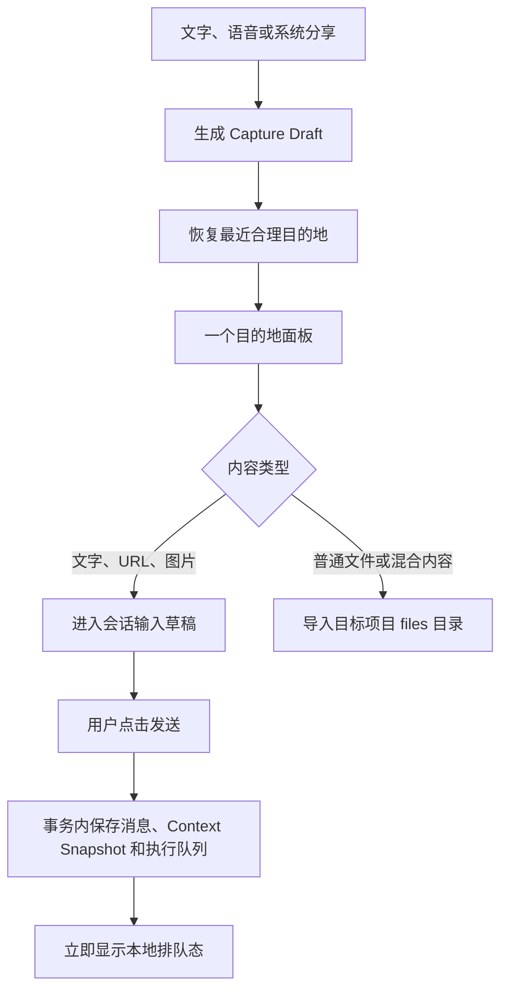

# M1 零摩擦捕获与上下文设计

日期：2026-08-07

实施周期：2026-08-08 至 2026-09-07

状态：可进入实施拆解

关联路线图：`docs/product-plan.md` v5

## 1. 目标

M1 只解决一件事：用户拿起手机后，可以在十几秒内把语音、分享内容或文字送进正确上下文，并且在任何失败、切屏或进程重建后都不需要重新输入。

核心结果：

- 空输入时，一次点击即可开始说话。
- 从 Android 系统分享进入 Harness 后，只经过一个目的地面板和一次发送确认。
- 冷启动后最多两次点击回到最近会话或项目。
- 输入区不再横向滚动多个配置 Chip，只保留一条可读的上下文摘要。
- 每次发送使用不可变的 Context Snapshot，旧消息不受后续配置变化影响。

北极星指标：**从意图出现到任务进入本地队列的中位时间小于 15 秒。**

## 2. 当前基线

可直接复用：

- `ChatExecutionEntryEntity` 已持久化 Provider、Model、Reasoning 和 `requestContextJson`，并支持进程重建后的执行恢复。
- `ChatExecutionRequestContext` 已保存项目上下文和精确 `WikiRef(wikiId, version)`。
- `QueuedAttachmentStore` 已能把图片复制到应用私有目录并进行生命周期清理。
- `Routes.chat` 已支持 `focusInput` 和 `sourceMessageId` 深链。
- 会话内消息搜索已经具备定位消息的能力。

需要替换或补齐：

- `ChatScreen` 的语音按钮目前只显示“暂未接入可用的语音输入方案”。
- 输入区上方横向排列项目、联网、语音、模型、身份、上下文和文件变更控件，在窄屏上需要滚动才能确认当前范围。
- `MainActivity` 只接收 `.hbundle`、`.hwiki` 及其通用 ZIP MIME，不接收普通文字、图片和文件分享。
- 全局没有跨会话和项目名称的统一搜索。
- 通过 `ACTION_SEND` 获得的 URI 权限可能随任务栈或进程消失，不能只持久化 URI 字符串。

## 3. 第一性原理取舍

### 3.1 保留

- 一个输入框。
- 一个随状态变化的尾部主按钮。
- 一个上下文摘要入口。
- 一个分享目的地面板。
- 一个全局搜索入口。

### 3.2 删除或隐藏

- 不要求先去“我的 -> 语音能力”启用语音，首次点击麦克风即处理权限。
- 不展示尚未真正支持的云端 STT、保存原始音频、自动标点等配置。
- 转写始终先进入输入框，M1 不提供自动发送开关。
- 不创建“收件箱”Tab、分享历史页或独立捕获模式。
- 不为项目、Agent、Wiki 和模型各放一个常驻 Chip。
- 不给全局搜索增加分类 Tab；默认统一排序，必要时再使用一个筛选菜单。

### 3.3 不改变

- 普通文字发送仍由用户确认。
- 项目文件写入、Markdown Apply、Commit 和 Push 的现有确认边界不变。
- `.hbundle` 和 `.hwiki` 继续优先进入各自安装预览，不能被普通文件分享流程截获。

## 4. 核心对象

### 4.1 Capture Draft

一次尚未发送或导入的捕获记录：

```kotlin
data class CaptureDraft(
    val id: String,
    val source: CaptureSource,
    val text: String,
    val stagedItems: List<CaptureItem>,
    val suggestedDestination: CaptureDestination?,
    val selectedDestination: CaptureDestination?,
    val status: CaptureStatus,
    val createdAt: Long,
    val expiresAt: Long?,
)
```

`CaptureSource`：`TYPED | VOICE | ANDROID_SHARE`。

`CaptureStatus`：`STAGING | READY | CONSUMED | FAILED | EXPIRED`。

只有包含外部暂存文件的 Android Share Draft 设置 24 小时过期时间；会话内文字和语音草稿不自动过期，直到发送、用户清空或会话删除。

### 4.2 Capture Item

```kotlin
data class CaptureItem(
    val id: String,
    val kind: CaptureItemKind,
    val displayName: String,
    val mimeType: String,
    val localUri: String,
    val sizeBytes: Long,
    val sha256: String,
)
```

外部 URI 只能用于读取。进入目的地面板前，图片和文件必须复制到 `cacheDir/capture-staging/<draftId>/`，因此进程重建不依赖外部授权。

### 4.3 Context Snapshot

不新增第二套执行上下文表。扩展现有 `ChatExecutionRequestContext`，以版本化 JSON 保存在 `ChatExecutionEntryEntity.requestContextJson`：

```kotlin
data class ContextSnapshotV2(
    val schemaVersion: Int = 2,
    val projectId: String?,
    val projectName: String?,
    val projectContextSha256: String?,
    val agentId: String?,
    val agentVersion: Int?,
    val wikiScope: List<WikiRef>,
    val providerId: String,
    val model: String,
    val reasoningEffort: String,
    val webSearchEnabled: Boolean,
    val attachments: List<AttachmentSnapshot>,
    val capturedAt: Long,
)
```

快照必须在用户消息和执行队列项同一事务内落库。队列项创建成功后，设置页或会话配置变化不得覆盖旧快照。

### 4.4 Search Document

M1 建立可由 M3 继续扩展的统一本地搜索文档：

```kotlin
data class LocalSearchDocument(
    val documentKey: String,
    val type: SearchDocumentType,
    val projectId: String?,
    val conversationId: String?,
    val messageId: String?,
    val title: String,
    val body: String,
    val sourceTitle: String?,
    val updatedAt: Long,
)
```

M1 只索引 `CONVERSATION | MESSAGE | MESSAGE_SOURCE | PROJECT_NAME`。项目文件正文留到 M3。

## 5. 主链路



## 6. 系统语音输入

### 6.1 入口与主按钮

输入框尾部只保留一个主按钮：

| 当前状态 | 主按钮 | 点击结果 |
| --- | --- | --- |
| 空文本、无附件、空闲 | 麦克风 | 请求权限或开始识别 |
| 有文本或附件、空闲 | 发送 | 发送当前草稿 |
| 正在识别 | 停止 | 结束本次识别并等待最终文本 |
| 本地或远程生成中 | 停止 | 沿用现有停止生成 |

语音不再放在上方配置 Chip 行，避免同一动作出现两个入口。

### 6.2 状态机

```text
IDLE
  -> REQUESTING_PERMISSION
  -> LISTENING
  -> FINALIZING
  -> IDLE

任一状态 -> ERROR -> IDLE
LISTENING -> CANCELLED -> IDLE
```

- `LISTENING` 时输入框显示系统返回的 partial result，原草稿保留在前部。
- partial result 只更新 UI，不写消息表。
- final result 使用现有 `mergeTranscriptIntoInput` 合并并持久化为 Capture Draft。
- 用户主动取消时恢复识别前草稿；用户停止时保留最终可用文本。
- 页面离开、来电、音频焦点丢失或 Activity 停止时结束识别，不在后台持续录音。

### 6.3 系统能力与降级

- 优先使用 `SpeechRecognizer`，启用 partial results，并传入当前语言。
- `SpeechRecognizer.isRecognitionAvailable` 为 false 时，降级到系统 `RecognizerIntent` Activity。
- 两者都不可用时，麦克风点击只显示一个可操作错误：“此设备没有可用的系统语音识别”，不引导配置 Provider。
- 系统语音服务可能联网。首次权限说明明确“音频由设备当前系统语音服务处理”，不承诺离线。

### 6.4 设置收敛

“语音能力”页 M1 只保留：

- 转写语言：跟随系统 / 中文 / English。
- 回复朗读开关与语速。
- 麦克风权限状态。

已有 `speechInputEnabled`、`autoFillInput`、`autoSendAfterTranscription`、`saveOriginalAudio` 和 Cloud Provider 字段保留兼容读取，但不再作为主链路前置条件；M1 固定为“可用即显示、填入输入框、不自动发送、不保存音频”。

## 7. Android 分享入口

### 7.1 Intent 范围

新增并按以下优先级路由：

1. 已识别的 `.hbundle` / `.hwiki`：继续现有安装流程。
2. `ACTION_SEND` 的 `text/plain`：读取 `EXTRA_TEXT`，URL 仍按文本处理。
3. `ACTION_SEND` / `ACTION_SEND_MULTIPLE` 的 `image/*`：暂存为会话图片草稿。
4. 其他可读文件：暂存后只允许导入项目。
5. 类型和文件名都不可信时先嗅探已有包格式，再降级为普通文件，不靠扩展名绕过包校验。

限制：

- 单次最多 10 项。
- 单文件默认最多 50 MiB，合计最多 100 MiB。
- 超限时在暂存阶段失败，不创建半成品项目文件。
- 文本最多保留 100,000 字符，超过后明确提示截断并由用户确认。

### 7.2 私有暂存

- 收到 Intent 后立即流式复制，并计算 SHA-256；不把外部 URI 直接写入草稿或消息表。
- 复制完成才展示目的地面板。
- `CONSUMED` 后，会话图片交给 `QueuedAttachmentStore`；项目文件原子移动到项目目录。
- 未消费暂存保留 24 小时；启动时清理过期目录和没有数据库记录的孤儿目录。
- 文件名必须去路径、去控制字符并处理重名，禁止 `..`、绝对路径和符号链接逃逸。

### 7.3 内容去向

| 内容 | 可选目的地 | 确认后的行为 |
| --- | --- | --- |
| 文字 / URL | 最近会话、最近项目、新会话 | 填入输入框，不自动发送 |
| 单张或多张图片 | 最近会话、最近项目、新会话 | 进入图片草稿，不自动发送 |
| 普通文件 | 最近项目、其他项目 | 导入 `files/`，不进入模型上下文 |
| 图片与普通文件混合 | 最近项目、其他项目 | 全部作为项目文件导入，不拆成两条流程 |

选择“项目”且内容为文字或图片时，复用该项目最近会话；不存在时自动创建项目会话。用户不需要先进入项目页。

### 7.4 目的地推荐

推荐是本地确定性规则，不调用 LLM：

1. 15 分钟内最后前台使用且兼容当前内容的会话或项目。
2. 7 天内最后一次分享使用的兼容目的地。
3. 最近更新的兼容会话或项目。

目的地面板结构：

```text
发送到

✓ CRM · 最近会话标题          最近使用
  生活 · 李德胜
  其他项目或会话...

                          [继续]
```

- 默认项已选中，正常路径只需点击“继续”。
- “其他”进入可搜索列表，不再叠加第二个确认对话框。
- 返回或下滑关闭面板不删除暂存，下一次打开继续。

## 8. 一键继续与全局搜索

### 8.1 首页

- 生活首页第一项是最近活跃会话，不增加“最近”说明卡。
- 工作首页第一项是最近项目；存在进行中任务时，由 M2 活动入口承接，不在 M1 预造任务卡。
- 顶栏增加统一搜索图标；生活和工作进入同一搜索页，但返回时恢复原 Tab 和滚动位置。

### 8.2 搜索体验

- 打开后输入框自动聚焦，100ms 防抖后本地返回首批结果。
- 空查询只显示最近打开的 5 个会话和项目，不展示功能说明。
- 默认结果混排，排序顺序为：标题精确匹配、正文匹配、来源标题匹配、更新时间。
- 每行只显示标题、最多两行命中片段、项目或生活范围、更新时间。
- 点击消息结果使用 `sourceMessageId` 定位；点击会话和项目结果进入现有页面。
- 长按结果不提供额外菜单，删除、归档等管理动作留在原对象页面。

### 8.3 中文索引

- 使用 Room FTS4 `unicode61`，同时把中文 2-gram / 3-gram 写入 `searchableText`。
- 抽取现有 `WikiSourceSearch` 的归一化与 CJK n-gram 逻辑为通用本地搜索工具，避免第三套中文分词实现。
- 消息只有在进入稳定状态后更新索引；流式 delta 不逐字重建 FTS。
- 删除会话、项目或消息时在同一事务清理搜索文档。

## 9. 单一上下文条

### 9.1 输入区结构

```text
┌──────────────────────────────────────┐
│ CRM · 李德胜 · 自动 2 库 · GPT-5  ▾ │  40dp 视觉高度，48dp 点击区
│ [图片预览，仅有附件时出现]           │
│ 说点什么...                    [🎙] │
└──────────────────────────────────────┘
```

- 删除当前可横向滚动的多个 Chip 行。
- 摘要顺序固定：项目、Agent、Wiki、模型；默认项可省略文字，但顺序不能变化。
- 文本一行省略，不能推动主按钮或改变输入区宽度。
- 联网搜索、上下文占用和文件变更模式作为摘要内的状态或二级配置，不再各占常驻 Chip。

### 9.2 上下文面板

点击摘要打开单一 Bottom Sheet：

```text
当前上下文
项目       CRM
身份       李德胜
知识范围   自动选择 · 2 个 Wiki
模型       GPT-5 · high
联网       关闭
上下文     38%
```

- 每行点击进入现有选择器或原位切换。
- 关闭面板立即回到输入，不额外出现“保存”按钮；每项变更即时持久化。
- 已输入文字和附件不因上下文变化而清空。
- 项目是会话归属，不是单轮临时筛选器：空会话可以在首次发送前选择项目；已有用户消息后项目行只读。
- 已有会话需要换项目时提供“在其他项目继续”，创建新的项目会话并带入当前草稿，不修改原会话的 `projectId`，也不迁移历史消息或 Markdown 弱关联。

## 10. 极致移动体验标准

### 10.1 动作预算

| 场景 | 最多动作 |
| --- | ---: |
| 冷启动继续最近会话 | 2 次点击 |
| 空输入开始语音 | 1 次点击；首次权限授权除外 |
| 分享文字到发出 | 目的地确认 + 发送，共 2 次 |
| 分享文件到最近项目 | 1 次确认 |
| 查看或调整全部上下文 | 1 次打开，1 次选择 |
| 全局搜索并定位已有消息 | 搜索入口 + 输入 + 结果点击 |

### 10.2 反馈时限

- 点击主按钮 100ms 内出现按压、排队或录音状态。
- 本地搜索首批结果 p95 小于 200ms，数据集以 50,000 条消息为验收上限。
- 分享 Intent 进入后 300ms 内显示“正在准备”稳定骨架；大文件复制展示确定或不确定进度。
- 语音 partial result 到输入框展示延迟目标小于 200ms，以系统回调时间为起点。

### 10.3 稳定布局

- 320dp 宽度和字体缩放 1.3 下，上下文摘要、输入框和主按钮不重叠。
- 输入区主按钮固定 48dp，状态变化不改变布局。
- Bottom Sheet 最大高度不遮住当前选中项，支持系统返回手势。
- 键盘出现、旋转、分屏和进程重建后恢复文字、附件、目的地与滚动位置。

### 10.4 无障碍与触觉

- 所有图标有动作型 `contentDescription`，例如“开始语音输入”“停止语音输入”“发送”。
- TalkBack 按“上下文摘要 -> 附件 -> 输入框 -> 主按钮”顺序读取。
- 开始录音、停止录音、分享导入完成使用轻触觉；错误不用连续振动。
- 系统“减少动态效果”开启时，不使用波形或尺寸变化动画，只切换图标和文字状态。

## 11. 数据与实现边界

### 11.1 Room

使用实施时的下一个可用迁移版本；当前基线为 20，若无并行迁移则为 20 -> 21。

新增：

- `capture_drafts`
- `capture_items`
- `local_search_documents`
- `local_search_fts`

扩展：

- `ChatExecutionRequestContext` JSON 升级为版本化 V2；旧 JSON 继续兼容读取。

### 11.2 建议代码边界

新增：

- `capture/CaptureDraftRepository.kt`
- `capture/IncomingShareParser.kt`
- `capture/CaptureStagingStore.kt`
- `ui/capture/CaptureDestinationSheet.kt`
- `voice/SystemSpeechRecognizer.kt`
- `search/LocalSearchRepository.kt`
- `search/LocalSearchTokenizer.kt`
- `ui/search/GlobalSearchScreen.kt`
- `ui/chat/ConversationContextBar.kt`

修改：

- `AndroidManifest.xml`
- `MainActivity.kt`
- `HarnessApkApp.kt`
- `ChatScreen.kt`
- `VoiceSettingsScreen.kt`
- `ChatExecutionModels.kt`
- `AppDatabase.kt`

`ChatScreen` 只消费状态和回调；语音生命周期、分享暂存和搜索索引不能继续堆进该 Composable。

## 12. 异常与安全

| 场景 | 行为 |
| --- | --- |
| 麦克风权限拒绝 | 保留草稿；再次点击可重试，永久拒绝时只给“去系统设置” |
| 系统识别超时 | 保留最后 partial result，并标记“未完成，可继续说” |
| 分享 URI 读取失败 | 不展示空目的地面板；给“重新分享”单一动作 |
| 暂存空间不足 | 原子失败并清理本次临时文件，不影响已有项目 |
| 目标对象被删除 | 回到目的地面板并自动选择下一个兼容目标，不静默新建 |
| 进程在复制中被杀 | 启动时把 `STAGING` 标记为失败并清理不完整文件 |
| Context Snapshot 编码失败 | 阻止入队并保留输入草稿，不降级为无快照发送 |
| 搜索索引损坏 | 从主数据可重建；搜索不可用不影响会话和项目 |

## 13. 测试与验收证据

### 13.1 JVM

- 语音状态机、partial/final 合并、取消恢复和错误降级。
- 分享 Intent 分类、包格式优先、文件名净化、大小上限和重名处理。
- 目的地推荐稳定排序及目标删除回退。
- Context Snapshot V1/V2 编解码和旧记录兼容。
- 中文 n-gram 搜索、排序、删除同步和 50,000 消息基准。

### 13.2 Instrumentation / Compose

- 首次权限、拒绝、永久拒绝、识别成功和旋转恢复。
- `ACTION_SEND` 文字、图片、普通文件及 `ACTION_SEND_MULTIPLE`。
- 外部 URI 授权消失后，暂存内容仍可发送或导入。
- 320dp、字体 1.3、TalkBack 顺序和输入法遮挡。
- 全局搜索点击后精确定位消息。

### 13.3 真机黄金链路

至少覆盖：

1. 浏览器分享 URL -> 最近项目会话 -> 补一句 -> 发送。
2. 相册分享两张图片 -> 最近生活会话 -> 发送。
3. 文件管理器分享 PDF -> 最近项目 -> 导入 `files/`。
4. 冷启动 -> 最近项目 -> 语音输入 -> 编辑 -> 发送。
5. 分享目的地面板停留时杀进程 -> 重开 -> 内容仍在。
6. 切换 Agent/Wiki 后发送 -> 旧消息仍显示原版本范围。

## 14. 四周交付

### 第 1 周：输入基础

- System Speech Recognizer、权限和状态机。
- 输入尾部主按钮收敛。
- Context Snapshot V2 和草稿恢复。

退出条件：语音可以不进设置完成“说 -> 改 -> 发”，失败不丢草稿。

### 第 2 周：系统分享

- Intent 解析、私有暂存、目的地推荐和项目文件导入。
- `.hbundle` / `.hwiki` 路由回归。

退出条件：文字、图片、文件三条真机链路通过，进程重建后可恢复。

### 第 3 周：搜索与上下文条

- 统一本地索引、全局搜索和消息深链。
- 单一上下文条与 Bottom Sheet。

退出条件：输入区无横向配置滚动，50,000 消息搜索性能达标。

### 第 4 周：极端环境与发布

- 320dp、字体 1.3、TalkBack、分屏、离线、空间不足和升级迁移。
- 完整黄金链路和 0.2.x test 发布说明。

范围熔断：若语音、分享或 Context Snapshot 任一主链路未通过，全局搜索可以顺延；不得反向顺延前三项去保搜索。

## 15. 完成定义

- 不进入设置即可使用系统语音输入，且永不自动发送。
- 分享文字到发送正常路径不超过两次确认，分享文件到最近项目只需一次确认。
- 外部 URI 权限消失、网络失败和进程重建均不丢草稿。
- 输入区没有横向滚动的配置 Chip，320dp 下仍可一眼看懂当前范围。
- Context Snapshot 能证明每次发送使用的项目、Agent 精确版本、Wiki 精确版本、模型和附件。
- 全局搜索只在本机运行，能从结果精确回到消息或项目。
- 没有新增顶层模式、收件箱、云端 STT Provider 或通用附件 RAG。
