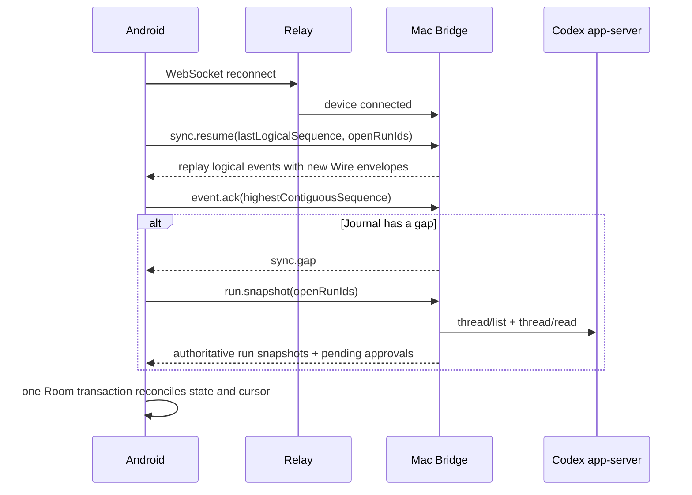

# M2 手机与 Mac 连续 Run 设计

日期：2026-08-07

实施周期：2026-09-08 至 2026-10-07

状态：可进入实施拆解，依赖 M1 Context Snapshot 与统一深链

关联路线图：`docs/product-plan.md` v5

## 1. 目标

M2 把现有“手机可以连接 Codex”升级为“一个项目任务可以在手机发起、Mac 执行、手机监督，并在离线或进程重建后继续”。

核心结果：

- 新任务必须从项目发起，不再让用户在手机输入 Mac 绝对路径。
- 用户离开 App 后，Run 状态、最新进展和未决审批仍然存在。
- 本地聊天生成和远程 Codex 进入同一个活动读模型，但不合并执行内核。
- 手机默认只展示目标、最新一行、待处理事项和可验证结果。
- 断网 10 分钟、Android 进程被杀和 Relay 重连后，不丢任务、不重复执行、不丢审批。

北极星指标：**用户可以只用手机完成“发起 -> 离开 -> 通知 -> 查看 -> 转向 -> 审批 -> 验收”的一次可信闭环。**

## 2. 当前基线

可直接复用：

- Relay 只转发加密 `RemoteWireMessage`，不读取正文。
- Android 与 Bridge 已使用 AES-GCM、Message ID、Sequence、ACK、离线队列和退避重连。
- Bridge 已接入 Codex app-server 的 `thread/list`、`thread/read`、`thread/start`、`turn/start`、`turn/steer`、`turn/interrupt` 和审批响应。
- `RemoteClient` 已能接收 Thread、Turn、Item、Agent Message Delta 和 Approval。
- Aliyun Push 已能发送唤醒型通知。
- 本地 `ChatExecutionEntry` 已是持久化、可恢复的执行对象。

必须修正：

- `RemoteUiState` 只围绕当前选中线程保存在内存，切换线程会清空 Timeline 和 Approval。
- `requestId` 每次调用临时生成，命令发送失败或进程重建后不能用同一 ID 安全重试。
- Wire 默认 5 分钟过期，Bridge 会删除过期 Pending Outbound；事件序号本身不能恢复 10 分钟离线窗口内丢失的事件。
- 新建线程要求在手机手输 `cwd`。
- Bridge 的 `threadOwners` 只在内存中，Bridge 进程重启后无法把线程事件路由回原设备。
- 审批直接展示“总是允许”，但当前协议没有证明该决定只作用于当前项目、工具和 Run。
- Timeline 直接展示内部 item kind 和 JSON，不适合快速监督。

## 3. 第一性原理取舍

### 3.1 用户操作的对象

用户操作的是**项目任务**，不是 Thread、Turn、WebSocket 或 app-server Item。

- Project：长期归属。
- Run：一次明确目标的执行。
- Thread：Codex 内部连续上下文，可承载多个 Run。
- Turn：Run 在 Codex 中的一次执行回合。
- Event：Run 的事实记录。

Thread、Turn 和 Event 保留在详情和诊断层，不新增顶层模式。

### 3.2 保留

- 项目内“在 Mac 上继续”一个入口。
- 首页顶栏一个活动图标。
- 活动页三个自然分组。
- Run 详情一个最新状态、一个时间线、一个输入区。
- 审批一次只处理一个明确动作。

### 3.3 删除或降级

- 移除全局“新建远程线程 + 输入绝对路径”主流程。
- 不在手机复制终端、IDE、原始 JSON 或完整 app-server 事件树。
- 不新增“任务”底部 Tab。
- 不把本地聊天和远程 Codex 强行重写为同一个执行器。
- 在无法证明作用域前，移除直接发送 app-server `allowAlways` 的按钮。
- 不为每一次只读查找弹审批。

## 4. 核心对象

### 4.1 Project Remote Binding

```kotlin
data class ProjectRemoteBinding(
    val id: String,
    val projectId: String,
    val hostId: String,
    val workspaceId: String,
    val cwd: String,
    val displayName: String,
    val repositoryFingerprint: String,
    val repositoryLabel: String?,
    val state: BindingState,
    val verifiedAt: Long,
    val createdAt: Long,
    val updatedAt: Long,
)
```

`BindingState`：`ACTIVE | HOST_OFFLINE | PATH_MISSING | FINGERPRINT_MISMATCH | UNBOUND`。

规则：

- 一个项目在 M2 只允许一个 Active Binding；数据模型保留多 Host 扩展能力，但 UI 不暴露切换矩阵。
- Binding 是映射，不复制、不拥有任何一端文件。
- `workspaceId` 和 `repositoryFingerprint` 由 Bridge 返回，Android 不自行拼接。
- Git remote 必须去除用户名、密码、Token 和查询参数后才能显示或参与指纹。
- 非 Git 目录也可以绑定，Bridge 使用规范化路径和本机文件身份生成不透明指纹。
- 解绑只删除映射；不删除项目、Codex Thread、Git 仓库或 Mac 文件。

### 4.2 Remote Run

```kotlin
data class RemoteRun(
    val id: String,
    val projectId: String,
    val bindingId: String,
    val hostId: String,
    val threadId: String?,
    val turnId: String?,
    val objective: String,
    val status: RunStatus,
    val latestLine: String,
    val lastLogicalSequence: Long,
    val startedAt: Long,
    val updatedAt: Long,
    val completedAt: Long?,
    val completionJson: String?,
    val errorMessage: String?,
)
```

`RunStatus`：

```text
QUEUED
STARTING
RUNNING
WAITING_APPROVAL
WAITING_USER
RECONCILING
COMPLETED
FAILED
CANCELLED
UNKNOWN
```

一个 Run 对应一个用户目标和一个 Codex Turn。完成后再次发送新目标，会在同一 Thread 下创建新 Run，而不是改写旧 Run。

### 4.3 Remote Command Outbox

```kotlin
data class RemoteCommandRecord(
    val commandId: String,
    val runId: String?,
    val type: String,
    val payloadSha256: String,
    val status: CommandStatus,
    val attemptCount: Int,
    val createdAt: Long,
    val acknowledgedAt: Long?,
)
```

- 命令必须先落库，再发送。
- 网络重试复用同一个 `commandId`，不能重新生成业务 ID。
- Bridge 以 `(deviceId, commandId)` 做幂等，并缓存完成结果至少 24 小时。
- `turn.start`、审批响应和停止命令重复到达时，只执行一次并返回原结果。

### 4.4 Logical Event

Wire Message 是短期传输包；Logical Event 是可恢复任务事实：

```go
type LogicalEvent struct {
    EventID     string
    DeviceID    string
    RunID       string
    Sequence    uint64
    Type        string
    Payload     json.RawMessage
    CreatedAt   int64
}
```

- `EventID` 和 Logical Sequence 在重放时保持不变。
- 每次重放重新生成 Wire Message ID、Nonce、Transport Sequence 和 5 分钟 `expiresAt`。
- Android 以 Logical Event ID 去重，以 Logical Sequence 推进恢复游标。

### 4.5 Remote Approval

```kotlin
data class RemoteApprovalRecord(
    val id: String,
    val runId: String,
    val logicalEventId: String,
    val serverRequestIdJson: String,
    val actionType: ApprovalActionType,
    val target: String,
    val commandPreview: String?,
    val risk: ApprovalRisk,
    val status: ApprovalStatus,
    val requestedAt: Long,
    val resolvedAt: Long?,
)
```

`ApprovalStatus`：`PENDING | ALLOWED | DENIED | EXPIRED | STALE`。

### 4.6 Activity Item

Activity 是读模型，不拥有执行：

```kotlin
data class ActivityItem(
    val id: String,
    val engine: ActivityEngine,
    val projectId: String?,
    val title: String,
    val latestLine: String,
    val status: ActivityStatus,
    val requiresAction: Boolean,
    val updatedAt: Long,
    val deepLink: String,
)
```

- `LOCAL_CHAT` 从 `ChatExecutionEntry` 和消息派生。
- `REMOTE_CODEX` 从 `RemoteRun` 和 `RemoteApprovalRecord` 派生。
- Activity Repository 只合并 Flow，不复制本地 Chat Execution 数据。

## 5. 协议恢复设计

### 5.1 Transport 与任务恢复分层

保留当前 5 分钟 Wire TTL，用于限制旧密文重放窗口；不通过简单延长 TTL 解决长任务恢复。

Bridge 新增每设备 Logical Event Journal：

- 事件先写 Journal，再加密发送。
- 未收到应用层 `event.ack` 的事件保留 7 天。
- 已 ACK 事件至少保留 24 小时，便于重复连接去重。
- 单设备上限 20,000 条或 100 MiB；超过时先删除最旧已 ACK 事件。
- 若必须删除未 ACK 事件，记录 Gap 起点，不能静默丢弃。
- Journal 内容用当前设备 Pairing Secret 加密保存；状态文件权限固定 `0600`。

Relay 继续只看加密 Wire，不增加任务正文数据库。

### 5.2 重连流程



规则：

- Android 只有在事件和衍生 Run/Approval 同一事务写入后才 ACK。
- Sequence 跳跃时进入 `RECONCILING`，不把 Run 错判为完成或失败。
- `thread/read` 是 Thread/Turn/Item 的权威快照；Bridge 的未决审批账本是网络断开期间审批的权威来源。
- 同一 Logical Event 重放不会重复插入时间线、通知或审批。
- Android 进程重建先从 Room 展示旧状态，再后台对账；页面不闪回空列表。

### 5.3 Bridge 和 app-server 边界

- Bridge 持久化 `threadId -> deviceId/projectBindingId` 路由，避免 Bridge WebSocket 重连后失去归属。
- 网络断开不重启 app-server，未决 JSON-RPC Approval 保持有效。
- 若 Bridge 或 app-server 进程真正重启，旧 `serverRequestId` 可能失效；对应审批标记 `STALE`，Run 进入 `RECONCILING`，不得显示可点击“允许”。
- M2 的“Bridge 重连”验收指 Relay/WebSocket 重连；Bridge 进程重启必须可理解恢复，但不承诺恢复已失效的 app-server 审批句柄。

### 5.4 能力协商

不立即破坏现有 Wire V1。`host.status` 增加加密 Payload 能力列表：

```json
{
  "capabilities": [
    "workspace.candidates.v1",
    "run.lifecycle.v1",
    "logical-replay.v1",
    "approval-scope.v1",
    "completion-evidence.v1"
  ]
}
```

- Android 只有检测到对应 capability 才展示新入口。
- 旧 Bridge 仍可进入历史 Remote Screen，但不能从项目发起 M2 Run。
- test 期完成 Bridge 与 APK 的向前、向后兼容矩阵。

## 6. 项目与 Mac 工作区绑定

### 6.1 入口

项目工作台提供一个上下文动作：

- 未绑定：`在 Mac 上继续`
- 已绑定且无进行中 Run：`交给 Mac`
- 有进行中 Run：显示当前状态，点击进入 Run 详情

不在项目页再放独立 Remote 卡；全局历史由活动入口承接。

### 6.2 首次绑定

用户不在手机输入路径：

1. 点击“在 Mac 上继续”。
2. Bridge 从最近 Codex Thread 中提取并去重 `cwd`，返回 Workspace Candidate。
3. Bottom Sheet 默认选中与项目名称或 Git remote 最匹配的候选。
4. 用户核对 Mac 名称、目录尾部、仓库名和分支，点击“绑定并继续”。
5. Android 保存 Weak Binding，进入目标输入页。

候选对象：

```kotlin
data class WorkspaceCandidate(
    val workspaceId: String,
    val displayName: String,
    val cwd: String,
    val repositoryLabel: String?,
    val branch: String?,
    val repositoryFingerprint: String,
    val lastUsedAt: Long,
)
```

- Bridge 不扫描整个磁盘，只使用 Codex 最近 Thread 的 cwd 和显式注册目录。
- 候选为空时，手机显示“先在 Mac Codex 中打开一次该项目”，不回退为路径输入框。
- “其他目录”只展示更多候选；新增目录在 Mac Bridge CLI 或未来桌面设置完成。

### 6.3 指纹变化

- 每次发起前由 Bridge 重新 inspect。
- 路径不存在：Binding 进入 `PATH_MISSING`，阻止启动。
- 同一路径仓库指纹变化：显示旧仓库与新仓库标签，要求“重新绑定”或“取消”。
- 只切换分支不使 Binding 失效，但发起前显示当前分支。
- 仓库 remote 凭证永不传到 Android。

## 7. 发起与转向

### 7.1 新 Run

```text
项目工作台 -> 交给 Mac -> 输入目标 -> 发送
```

- 已绑定时不再出现 Workspace 选择。
- 发送前本地创建 `RemoteRun(QUEUED)` 和 `RemoteCommandRecord`。
- 100ms 内进入 Run 详情并显示“等待 Mac 接收”。
- Bridge 收到后选择该 Binding 最近 Thread；不存在时创建 Thread，再启动 Turn。
- 目标、项目、Binding 和协议能力形成 Remote Context Snapshot，后续重新绑定不改写旧 Run。

### 7.2 转向

- Run 为 `RUNNING` 时，底部输入框文案为“补充方向”。
- 发送补充使用 `turn.steer`，并作为 Run Event 展示。
- Steering 不创建第二个 Run，不修改原目标；完成卡保留“原目标 + 后续补充”。
- 连续点击只产生一个 Outbox 命令；发送中主按钮禁用并保持布局。

### 7.3 停止

- 停止是 Run 详情顶栏图标动作，第一次点击打开简短确认 Sheet：`停止任务？已完成的改动不会自动撤销。`
- 确认后发送幂等 `turn.interrupt`。
- 状态先进入 `CANCELLING` 的 UI 派生态，再以 Codex 事件决定 `CANCELLED` 或 `COMPLETED`。
- 不承诺撤回 Mac 文件；完成卡仍展示停止前已发生的变更证据。

## 8. 统一活动入口

### 8.1 入口与徽标

- 生活、工作首页顶栏使用同一个 Activity 图标。
- 徽标数字只计算 `WAITING_APPROVAL` 和需要用户恢复的失败，不计算普通进行中任务。
- 无活动时不显示徽标；图标仍可打开最近完成历史。
- 点击通知和首页图标进入同一 Activity 路由。

### 8.2 页面结构

不用 Tab，按自然优先级纵向排列：

```text
活动

需要我处理  2
  CRM · 需要批准修改 3 个文件          刚刚
  Harness · 任务恢复失败              2 分钟

进行中
  CRM · 正在运行测试                  4 分钟

最近完成
  Harness · 已完成登录流程修复         今天
```

- 使用 ListItem/分隔线，不把页面区块做成浮动 Card。
- 每行固定展示项目、最新一行、时间和状态图标。
- 本地 Chat 与 Remote Run 使用相同信息层级，不显示执行器技术名；详情中可以看到“本机生成”或“Mac Codex”。
- `最近完成` 默认保留 7 天或 50 条，只是查询窗口，不删除底层会话与 Thread。

## 9. Run 详情与时间线

### 9.1 首屏

```text
←  CRM                                  ■
修复登录后返回错误页面
Mac mini · /.../hplus · test

正在运行测试                         12:41
查看完整过程 ▾

[需要审批时的动作区]

------------------------------------------
补充方向...                         [发送]
```

- 首屏第一信号是项目和目标，不是 Host 或协议。
- 最新状态一行固定占位，长文本省略；状态切换不改变页面布局。
- 默认折叠完整过程，沿用思考过程“最新一行 + 展开/折叠”心智。
- 工作区路径显示尾部，点击后才查看完整路径和仓库指纹。

### 9.2 事件翻译

主视图只使用：

- 正在分析
- 正在查找
- 正在修改 N 个文件
- 正在运行测试
- 等待你的确认
- 正在整理结果
- 已完成
- 已停止
- 需要恢复

原始 `item.kind`、JSON、完整命令和 Delta 放在展开后的证据详情。未知事件显示“正在处理”，并保留原始诊断，不把 JSON 当用户文案。

### 9.3 事件压缩

- 同一文件的 started/completed 合并为一条。
- 连续 Agent Message Delta 合并为一个稳定消息项。
- 连续相同阶段只更新最新一行，不追加几十条重复状态。
- 用户发送目标、转向、审批决定、停止和完成永不被压缩掉。

## 10. 审批

### 10.1 风险分级

| 风险 | 示例 | 默认交互 |
| --- | --- | --- |
| 低 | 读取文件、列目录、读取 Git 状态 | 在已授权项目范围内自动执行并记录 |
| 中 | 修改项目文件、运行已知测试命令 | 明确展示对象，允许一次 |
| 高 | 任意 Shell、联网、安装依赖、删除、Git Commit/Push | 展示完整影响，逐次批准 |
| 未知 | 无法分类的方法或参数 | 按高风险处理 |

风险分类是本地确定性策略，不能让 LLM 自报风险等级。

### 10.2 审批卡

```text
需要确认 · 高风险
运行命令
./gradlew connectedDebugAndroidTest

工作区  harness-apk
影响    可能启动模拟器并写入构建目录

[允许一次]   [拒绝]
```

- 一个审批只展示一个主允许动作和一个拒绝动作。
- 完整命令、路径和环境变量默认折叠，但批准前可以展开。
- 密钥、Token 和带凭证 URL 必须脱敏。
- 审批处理后保留为时间线证据，不直接消失。

### 10.3 任务内授权

只有 Bridge 能强制执行 `projectId + runId + tool + normalizedTarget` 精确作用域时，才可以提供“本任务内允许同类只读动作”。

- 文件写入、任意 Shell、联网、删除、Commit 和 Push 不提供任务外永久放行。
- 若 app-server 只有语义不明确的 `allowAlways`，M2 不发送该决定。
- Scope Policy 存在 Bridge 内存和 Run Journal 中，Run 完成即销毁。

### 10.4 通知

- 通知只提供“查看”“拒绝”“停止”。
- 写入、命令、联网和 Git 的“允许”必须解锁并进入 Run 详情。
- 通知正文只显示项目名和动作类型，不显示完整命令、文件内容或 Prompt。
- 重复点击通知使用同一幂等 Command ID，不会处理两次。

## 11. 结构化完成卡

### 11.1 数据

```kotlin
data class RunCompletion(
    val summary: String,
    val changedFiles: List<ChangedFileEvidence>,
    val testEvidence: List<TestEvidence>,
    val gitEvidence: GitEvidence?,
    val unresolved: List<String>,
    val completedAt: Long,
)
```

证据只从结构化 Codex Item 和明确退出状态派生：

- `fileChange` -> 变更文件。
- `commandExecution` + exit code -> 测试或命令结果。
- 明确 Git Item -> 分支、Commit、Push 状态。
- Agent 自述“测试通过”不能单独变成绿色测试证据。
- 缺少数据时显示“未验证”，不猜测。

### 11.2 UI

```text
已完成
修复登录返回路径，并补充 3 条测试

文件  4 个
测试  12 通过 · 0 失败
Git   未提交
遗留  1 项

[查看结果]  [沉淀到项目]
```

- 完成卡是 Run 的结果工具，可以使用一个 8dp 以内圆角容器。
- 只显示一条摘要和四类证据；文件清单、日志和 Diff 按需展开。
- “沉淀到项目”在 M2 只生成入口事件，完整闭环由 M3 实现。
- 失败卡只给一个主动作：`恢复任务` 或 `去 Mac 查看`，根据是否可恢复决定。

## 12. 极致移动体验标准

### 12.1 动作预算

| 场景 | 最多动作 |
| --- | ---: |
| 已绑定项目发起 Run | 项目入口 + 输入发送，共 3 次点击内 |
| 查看待审批 | 通知或 Activity 一次进入 |
| 允许一次 | 详情中一次点击；高风险先展开证据不计确认 |
| 给运行中任务补充方向 | 进入 Run + 输入发送 |
| 从完成通知查看结果 | 一次点击直达完成卡 |

### 12.2 信息预算

- 活动列表每项最多三行。
- Run 折叠态只显示目标、最新一行和待处理动作。
- 主视图不出现 Thread ID、Turn ID、JSON 方法名或 Sequence。
- 一个屏幕只有一个主动作；审批出现时，发送区降低视觉优先级。

### 12.3 稳定与性能

- Activity 首屏只读 Room，p95 小于 200ms，不等待 WebSocket。
- 收到事件后 100ms 内更新本地状态；数据库写入和 ACK 同一事务边界。
- 10,000 条 Logical Event 下，Run 详情首次渲染只加载最近 100 条，向上分页。
- 320dp、字体 1.3 下审批动作换行但不截断，命令文本横向滚动仅存在于展开证据区。
- 进程重建后先展示最后持久状态，再显示“正在核对”，不闪空白。

### 12.4 无障碍

- 状态变化通过 TalkBack live region 简短播报，不逐个朗读流式 Delta。
- 徽标同时提供“2 个待处理任务”语义，不能只靠颜色。
- 风险等级有文字和图标，不只使用红黄绿。
- 停止、拒绝和允许按钮保持至少 48dp 触控区域。

## 13. 数据与代码边界

### 13.1 Android Room

若 M1 使用 20 -> 21，M2 使用 21 -> 22；并行开发时使用下一个可用迁移号。

新增：

- `project_remote_bindings`
- `remote_runs`
- `remote_run_events`
- `remote_approvals`
- `remote_command_outbox`
- `remote_sync_cursors`

### 13.2 Android 代码

新增：

- `remote/RemoteRunRepository.kt`
- `remote/RemoteCommandOutbox.kt`
- `remote/RemoteEventReducer.kt`
- `remote/RemoteSyncCoordinator.kt`
- `remote/RemoteApprovalPolicy.kt`
- `activity/ActivityRepository.kt`
- `ui/activity/ActivityScreen.kt`
- `ui/activity/RunDetailScreen.kt`
- `ui/project/ProjectRemoteBindingSheet.kt`

重构：

- `RemoteRepository` 只负责 Transport 和连接，不直接拥有完整 UI State。
- `RemoteScreen` 降级为兼容旧 Bridge 的诊断入口；M2 主流程进入 Activity/Run Detail。
- `RemotePushReceiver` 只解析安全 Deep Link，不在 Receiver 中直接改审批状态。

### 13.3 Bridge

新增：

- Logical Event Journal。
- Command ID 幂等结果缓存。
- 持久化 Thread Owner / Binding 路由。
- Workspace Candidate / Inspect。
- Resume、Gap、Snapshot 和 Approval Ledger。

Relay 不新增明文任务存储，仍保持不透明转发。

## 14. 异常与恢复

| 场景 | 行为 |
| --- | --- |
| Mac 离线 | Run 保持 `QUEUED`，显示“等待 Mac”，可取消，不重复创建 Thread |
| Relay 断开 10 分钟 | 重连后 Logical Replay，再做 Snapshot 对账 |
| Android 进程被杀 | 从 Room 恢复，复用 Outbox Command ID |
| Journal 出现 Gap | Run 进入 `RECONCILING`，禁止审批，完成 Snapshot 后再开放 |
| Binding 指纹变化 | 发起前阻断，要求重新绑定 |
| Thread 被 Mac 删除 | Run 标记 `FAILED`，保留已有事件，主动作“新建任务” |
| 审批已在 Mac 处理 | Snapshot 将手机审批更新为对应结果，不再可点 |
| Approval Server Request 失效 | 标记 `STALE`，不伪造拒绝或允许 |
| 重复 Turn Start | Bridge 返回同一 Thread/Turn 结果，不再次执行 |
| Completion 证据不全 | 缺失项显示“未验证”，不把 Agent 文案当证据 |

## 15. 测试与验收证据

### 15.1 Android JVM

- Run 状态机所有合法/非法转换。
- Logical Event 去重、乱序、Gap 和事务游标推进。
- Command Outbox 重试复用 ID，重复结果不重复执行 UI 副作用。
- Activity Repository 合并本地与远程对象的分组和排序。
- 审批风险分类、脱敏、过期和 Stale。
- Completion Evidence 只接受结构化事实。

### 15.2 Go

- Journal 写入后发送、ACK 后清理、过期 Wire 重新加密重放。
- 断网超过 5 分钟但小于 10 分钟仍可恢复 Logical Event。
- Command ID 结果缓存和 `turn.start` 幂等。
- Workspace Candidate 不泄漏 remote 凭证。
- Thread Owner 在 Relay 重连后保持。
- Journal Gap 和 Snapshot 回退。

### 15.3 Instrumentation / Compose

- 项目首次绑定、候选为空、指纹变化和解绑。
- Activity 徽标、三个分组、精确 Deep Link。
- 审批从通知进入、拒绝、允许一次和重复点击。
- 320dp、字体 1.3、TalkBack、长命令和多文件完成卡。
- Android 进程死亡后 Run/Approval 首屏立即恢复。

### 15.4 故障注入黄金链路

1. 发起后立刻断网 10 分钟，再恢复并完成。
2. 收到审批后杀 Android 进程，重开并处理。
3. 同一个批准命令发送两次，只生效一次。
4. Bridge WebSocket 重连，Thread Owner 和项目归属保持。
5. Journal 人为制造 Gap，页面先显示核对状态，再恢复权威快照。
6. Mac 侧先处理审批，手机重连后正确消除未决状态。
7. 任务完成但没有测试事件，完成卡显示“测试未验证”。

## 16. 四周交付

### 第 5 周：项目绑定与协议能力

- Workspace Candidate、Inspect、Weak Binding 和 Capability Negotiation。
- 项目内发起入口，移除手机路径输入主流程。

退出条件：已有绑定项目三次点击内进入 `QUEUED` Run。

### 第 6 周：持久化与恢复

- Remote Run/Outbox/Approval Room。
- Logical Event Journal、Replay、ACK、Gap 和 Snapshot。

退出条件：5 分钟 Wire TTL 不再导致 10 分钟断网丢事件；重复命令不重复执行。

### 第 7 周：Activity 与审批

- 统一活动读模型、首页徽标、通知 Deep Link 和风险审批。
- 移除不受控 `allowAlways`。

退出条件：所有未决审批从通知和 Activity 到达同一持久状态。

### 第 8 周：时间线、完成卡与故障回归

- 最新一行、事件翻译、结构化完成卡。
- 断网、进程死亡、Bridge 重连、窄屏和无障碍验收。

范围熔断：Weak Binding、Run 持久化和审批可达是必达项；若恢复测试未通过，完整时间线视觉优化和丰富完成卡顺延。

## 17. 完成定义

- 新 Remote Run 必须从项目发起，用户不在手机输入绝对路径。
- Run、命令、事件和审批都有稳定 ID 与持久状态。
- 5 分钟 Wire TTL 与长期恢复解耦，10 分钟断网恢复有 Logical Replay 和权威 Snapshot 两层证据。
- Activity 页面不复制执行器，只统一展示“需要处理、进行中、最近完成”。
- 默认只展示最新一行，原始 JSON 和完整日志按需展开。
- 未经解锁详情页不能批准高风险动作；没有不受控的永久允许。
- 完成卡对文件、测试和 Git 只展示结构化证据，缺失时明确“未验证”。
- 没有新增任务 Tab、手机终端、隐藏文件同步或 Android 本地代码执行。
